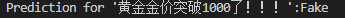

# 使用BERT进行虚假新闻检测

社交网络的新闻往往包括新闻内容，社交上下文内容，以及外部知识。其中新闻内容指的是文章中所包含的文本信息以及图片视频等多模态信息。社交上下文信息指的是新闻的发布者，新闻的传播网络，以及其他用户对新闻的评论和转发。外部知识指客观事实知识，通常由知识图谱表示外部知识。
虚假新闻检测的定义是给定新闻文章的新闻内容，社交上下文内容，以及外部知识，去判断新闻文章的真假。

 虚假新闻确实危害了人们的生活，但是人工对虚假新闻检测会消耗大量的人力和物力，消耗大量时间，因此无法线上进行识别，因此需要自动的对虚假新闻进行检测，自动的虚假新闻检测是十分有必要的。

因此，训练一个模型去识别生活中的各类新闻变得十分重要


在本案例中，我们将使用Weibo21数据集去训练Bert-base-Chinese模型。

Weibo21该数据集从微博社区管理中心爬取了2014年12月至2021年3月的数据，保证了数据的时间分布范围与虚假数据一致。并且收集了多个维度的信息，包括文本内容、配图、时间戳、评论、辟谣信息（只针对虚假信息）。一共4,488条虚假新闻和4,640条真实新闻。

Bert-base-chinese模型在中文自然语言处理任务中表现良好，尤其适用于文本分类任务，如假新闻检测。

### 下载数据集，模型，安装必要环境

#### 数据集

安装Huggingface和modelscope依赖库：

```bash
!pip install -U huggingface_hub -i https://pypi.tuna.tsinghua.edu.cn/simple
!pip install modelscope -i https://pypi.tuna.tsinghua.edu.cn/simple
```

由于国内网络限制，直接下可能会很慢

这里推荐使用镜像：

```bash
!export HF_ENDPOINT=https://hf-mirror.com
```

下载Weibo21数据集：

```bash
!mkdir weibo21
```

```bash
!huggingface-cli download --repo-type dataset --resume-download FinanceMTEB/MDFEND-Weibo21 --local-dir weibo21
```

#### 模型下载

数据集下载完成后

接下来从modelscope上下载base模型：bert-base-chinese

```bash
!mkdir bert-base-chinese
```

```bash
!modelscope download --model tiansz/bert-base-chinese --local_dir bert-base-chinese
```

#### 准备环境

```bash
!pip install transformers datasets==3.5.1 accelerate scikit-learn torch -i https://pypi.tuna.tsinghua.edu.cn/simple
```

至此 前期准备工作完成！

### 训练bert-base-Chinese预测虚假新闻

首先导入依赖库

```python
from transformers import BertTokenizer, BertForSequenceClassification, Trainer, TrainingArguments
from datasets import Dataset, DatasetDict
import pandas as pd
from sklearn.metrics import accuracy_score
import numpy as np

```

**导入数据集并封装**

```python
# 数据路径
data_dir = "/weibo21/data" #替换为你的实际路径

# 使用 pandas 加载 Parquet 文件
train_df = pd.read_parquet(f"{data_dir}/train-00000-of-00001.parquet")
test_df = pd.read_parquet(f"{data_dir}/test-00000-of-00001.parquet")

# 转换为 Dataset 对象
train_dataset = Dataset.from_pandas(train_df)
test_dataset = Dataset.from_pandas(test_df)

# 创建 DatasetDict
dataset = DatasetDict({
    'train': train_dataset,
    'test': test_dataset
})

# 打印数据集以确认加载成功
print(dataset)

```


数据构成如图所示，训练数据有554条，测试数据集有238条，其中Sentence为新闻文本

label的值为0,1 分别表示True,False。


**加载 BERT 模型和分词器**

```python

model = BertForSequenceClassification.from_pretrained(
    '/bert_base_chinese', #替换为你的实际路径
    num_labels=2
)
tokenizer = BertTokenizer.from_pretrained(
    'bert_base_chinese'
)

def preprocess_function(examples):
    result=tokenizer(examples['sentence'],
                    padding="max_length",
                    max_length=128,
                    truncation=True,
                    return_tensors='pt')
    
    result["labels"]=[int(label) for label in examples['label']]
    return result

encoded_dataset=dataset.map(preprocess_function,batched=True)
```

**定义训练参数，开始训练：**

首先创建一个文件夹用于保存训练后的模型

```bash
!mkdir final_model
```

```python
def compute_metrics(pred):
    labels=pred.label_ids
    preds=pred.predictions.argmax(-1)
    accuracy=accuracy_score(labels,preds)
    return {'accuracy':accuracy}

training_args=TrainingArguments(
    num_train_epochs=3,
    per_device_train_batch_size=8,
    per_device_eval_batch_size=8,
    warmup_steps=500,
    weight_decay=0.01,
    logging_steps=10,
    eval_strategy="epoch",
    save_strategy="epoch",
)

trainer=Trainer(
    model=model,
    args=training_args,
    train_dataset=encoded_dataset["train"],
    eval_dataset=encoded_dataset["test"],
    compute_metrics=compute_metrics,
)

trainer.train()
eval_results=trainer.evaluate()
print("Evaluation results:",eval_results)
trainer.save_model("/final_model") #替换为你的实际路径
tokenizer.save_pretrained("/final_model")
```

部分训练过程如下：


训练结果如下：


验证集的损失为0.33


加载训练后的模型进行推理预测：

```python
model = BertForSequenceClassification.from_pretrained(
    '/final_model', #替换为你的实际路径
    num_labels=2
)
tokenizer = BertTokenizer.from_pretrained(
    '/final_model'
)

def predict(text):
    inputs=tokenizer(text,return_tensors='pt',padding=True,truncation=True,max_length=128)
    outputs=model(**inputs)
    prediction=outputs.logits.argmax(-1).item()
    return "Fake" if prediction==1 else "Real"

sample_text="黄金金价突破1000了！！！"
print(f"Prediction for '{sample_text}':{predict(sample_text)}")
```

推理结果：

