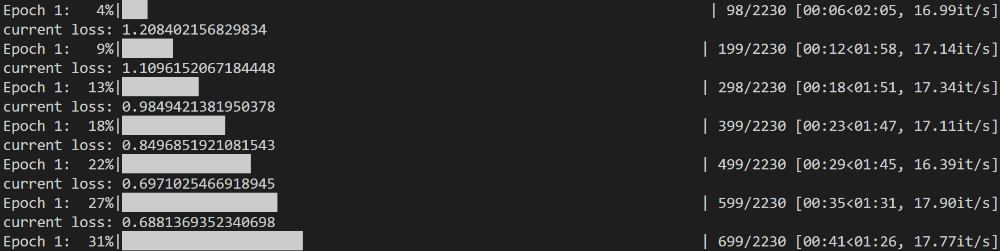

# 中文语义角色标注

## 概述

自然语言的语义理解往往包括分析构成一个事件的行为、施事、受事等主要元素，以及其他附属元素（adjuncts），例如事件发生的时间、地点、方式等。在事件语义学（Event semantics）中，构成一个事件的各个元素被称为语义角色（Semantic Roles）；而语义角色标注（Semantic Role Labeling）任务就是识别出一个句子中所有的事件及其组成元素的过程，例如：其行为（往往是句子中的谓词部分），施事，事件，地点等。下图中，例子中的一个事件“生产”被识别出来，而“生产”对应的施事“全行业”和受事“化肥二千七百二十万吨”以及附属的事件发生的时间“全年”被准确标注出来。语义角色标注可为许多下游任务提供支持，例如：更深层的语义分析（AMR Parsing，CCG Parsing等），任务型对话系统中的意图识别，事实类问答系统中的实体打分等。

语义角色标注标签集合为：


### 方法

下面是一个语义标注的实例：


利用huggingface/transformers中的albert+crf进行中文语义角色标注

利用albert加载中文预训练模型，后接一个前馈分类网络，最后接一层crf。利用albert预训练模型进行fine-tune。

整个流程是：

- 数据经albert后获取最后的隐层hidden_state=768

- 将last hidden_state=768和谓词位置指示器（predicate_indicator）进行concatenation，最后维度是（768 + 1）经一层前馈网络进行分类

- 将前馈网络的分类结果输入crf

  


接下来将详细介绍实验的过程。

## 实验

### 准备环境

安装必要的依赖库：

```bash
pip install torch==2.7.0 transformers==4.51.3 scikit-learn -i https://pypi.tuna.tsinghua.edu.cn/simple
```

安装modelscope库以便于下载模型

```bash
pip install modelscope -i https://pypi.tuna.tsinghua.edu.cn/simple
```

### 下载模型和数据集

在该实验中，我们使用的base模型是BERT-base-Chinese，这是一个经过中文数据集微调后的BERT模型，在中文语义理解上有出色的表现，同时模型的参数量不大，在消费级显卡上能够顺利运行。

摩达上提供了该模型的下载方式：


先创建一个模型目录用于存放下载模型。

```
!mkdir bert-base-chinese
```

运行以下命令：

```bash
!modelscope download --model tiansz/bert-base-chinese --local_dir bert-base-chinese
```


接下来创建一个数据集目录用于存放训练和验证数据集

```bash
!mkdir dataset
```

下载数据集：

```
!git clone https://ghfast.top/https://github.com/Enermy/BERT-Semantic-Role-Labeling.git
```

至此，实验的准备工作已经完成1!

### 实验代码

#### 导入依赖模块

```python
import torch
import torch.nn as nn
from torch.utils.data import Dataset, DataLoader
from transformers import BertTokenizer, BertForTokenClassification
from torch.optim import AdamW

from sklearn.preprocessing import LabelEncoder
import numpy as np
from tqdm import tqdm
import os

```

#### 自定义数据集类

用于读取数据文件，进行分词和标签处理，最终供模型训练/评估使用。

核心组成：

- `__init__`: 读取原始标注数据，初始化分词器和标签编码器。
- `load_data`: 按照每行“token + label”的格式解析文件。
- `__len__`: 返回样本数量。
- `__getitem__`: 分词、标签对齐、处理 padding，输出模型训练所需字段。

```python
# Set device
device = torch.device("cuda" if torch.cuda.is_available() else "cpu")

# Dataset class
class SRLDataset(Dataset):
    def __init__(self, file_path, tokenizer, label_encoder, max_len=128):
        self.sentences = []
        self.labels = []
        self.tokenizer = tokenizer
        self.label_encoder = label_encoder
        self.max_len = max_len
        self.load_data(file_path)

    def load_data(self, file_path):
        sentence = []
        sentence_labels = []
        with open(file_path, 'r', encoding='utf-8') as f:
            for line in f:
                line = line.strip()
                if not line:  # Blank line indicates end of sentence
                    if sentence:
                        self.sentences.append(sentence)
                        self.labels.append(sentence_labels)
                        sentence = []
                        sentence_labels = []
                    continue
                parts = line.split()
                if len(parts) < 3:
                    continue
                token, _, label = parts[0], parts[1], parts[2]
                sentence.append(token)
                sentence_labels.append(label)
            if sentence:  # Handle last sentence
                self.sentences.append(sentence)
                self.labels.append(sentence_labels)

    def __len__(self):
        return len(self.sentences)

    def __getitem__(self, idx):
        sentence = self.sentences[idx]
        labels = self.labels[idx]

        # Tokenize
        encoding = self.tokenizer(
            sentence,
            is_split_into_words=True,
            return_tensors='pt',
            padding='max_length',
            truncation=True,
            max_length=self.max_len
        )

        # Convert labels to IDs
        label_ids = [self.label_encoder.transform([label])[0] for label in labels]
        # Align labels with tokenized input        # Pad/truncate labels to match tokenized input
        label_ids = label_ids[:self.max_len - 2]  # Account for [CLS] and [SEP]
        label_ids = [-100] + label_ids + [-100]  # [CLS] and [SEP] get ignored
        label_ids += [-100] * (self.max_len - len(label_ids))  # Pad

        return {
            'input_ids': encoding['input_ids'].squeeze(),
            'attention_mask': encoding['attention_mask'].squeeze(),
            'labels': torch.tensor(label_ids, dtype=torch.long)
        }
```

#### 标签提取函数 `get_labels`

从训练和验证数据集中提取所有出现过的标签，用于初始化 LabelEncoder 和设置模型的输出维度。

```python
# Get all unique labels
def get_labels(file_paths):
    labels = set()
    for file_path in file_paths:
        with open(file_path, 'r', encoding='utf-8') as f:
            for line in f:
                line = line.strip()
                if line and len(line.split()) >= 3:
                    labels.add(line.split()[2])
    return sorted(list(labels))
```

####  模型训练函数 `train_model`

对模型进行多轮训练。

每个 batch 执行一次前向传播 + 反向传播 + 梯度更新。

每轮结束后在验证集上评估模型性能。

```python
# Training function
def train_model(model, train_loader, dev_loader, epochs=3, lr=2e-5):
    optimizer = AdamW(model.parameters(), lr=lr)
    model.train()
    for epoch in range(epochs):
        total_loss = 0
        i=0
        for batch in tqdm(train_loader, desc=f"Epoch {epoch + 1}"):
            input_ids = batch['input_ids'].to(device)
            attention_mask = batch['attention_mask'].to(device)
            labels = batch['labels'].to(device)
            i+=1
            outputs = model(
                input_ids=input_ids,
                attention_mask=attention_mask,
                labels=labels
            )
            loss = outputs.loss
            total_loss += loss.item()
            if i%100==0:
                print("current loss:",loss.item())
            optimizer.zero_grad()
            loss.backward()
            optimizer.step()

        avg_loss = total_loss / len(train_loader)
        print(f"Epoch {epoch + 1}, Average Loss: {avg_loss:.4f}")

        # Evaluate on dev set
        evaluate_model(model, dev_loader)

```

训练过程如下



#### 模型评估函数 `evaluate_model`

在验证集上评估模型的平均损失。

使用 `torch.no_grad()` 禁止梯度计算，提高推理效率

```python
def evaluate_model(model, data_loader):
    model.eval()
    total_loss = 0
    with torch.no_grad():
        for batch in data_loader:
            input_ids = batch['input_ids'].to(device)
            attention_mask = batch['attention_mask'].to(device)
            labels = batch['labels'].to(device)

            outputs = model(
                input_ids=input_ids,
                attention_mask=attention_mask,
                labels=labels
            )
            total_loss += outputs.loss.item()

    avg_loss = total_loss / len(data_loader)
    print(f"Validation Loss: {avg_loss:.4f}")
    model.train()
```

#### 预测函数 `predict_sentence`

对输入句子进行分词、编码，送入训练好的模型进行预测。

预测结果经过 `argmax` 提取标签 ID，再通过标签编码器转换为标签字符串。

最后返回原始字符与预测标签的对应表。

```python
# Prediction function
def predict_sentence(model, tokenizer, label_encoder, sentence, max_len=128):
    model.eval()
    # Tokenize input sentence
    tokens = list(sentence)
    encoding = tokenizer(
        tokens,
        is_split_into_words=True,
        return_tensors='pt',
        padding='max_length',
        truncation=True,
        max_length=max_len
    )

    input_ids = encoding['input_ids'].to(device)
    attention_mask = encoding['attention_mask'].to(device)

    with torch.no_grad():
        outputs = model(input_ids=input_ids, attention_mask=attention_mask)
        logits = outputs.logits
        predictions = torch.argmax(logits, dim=-1).cpu().numpy()[0]

    # Map predictions to labels
    predicted_labels = []
    for i, pred in enumerate(predictions):
        if i == 0 or i == len(predictions) - 1:  # Skip [CLS] and [SEP]
            continue
        if i - 1 < len(tokens):  # Align with original tokens
            predicted_labels.append(label_encoder.inverse_transform([pred])[0])
        else:
            break

    return list(zip(tokens, predicted_labels))
```

#### main()

设置路径、加载分词器与模型。

准备训练与验证数据集。

初始化 BERT 模型用于序列标注（Token Classification）。

启动训练过程，保存训练好的模型。

演示一个句子的预测效果。

```python
# Main execution
def main():
    # Paths
    model_path = "bert-base-chinese"
    train_path = "BERT-Semantic-Role-Labeling/data/example.train"
    dev_path = "BERT-Semantic-Role-Labeling/data/example.dev"

    # Initialize tokenizer
    tokenizer = BertTokenizer.from_pretrained(model_path)

    # Get labels
    labels = get_labels([train_path, dev_path])
    label_encoder = LabelEncoder()
    label_encoder.fit(labels)
    num_labels = len(labels)

    # Initialize datasets
    train_dataset = SRLDataset(train_path, tokenizer, label_encoder)
    dev_dataset = SRLDataset(dev_path, tokenizer, label_encoder)

    # Data loaders
    train_loader = DataLoader(train_dataset, batch_size=8, shuffle=True)
    dev_loader = DataLoader(dev_dataset, batch_size=8)

    # Initialize model
    model = BertForTokenClassification.from_pretrained(
        model_path,
        num_labels=num_labels
    ).to(device)

    # Train
    train_model(model, train_loader, dev_loader, epochs=3)

    # Save model
    model.save_pretrained("./srl_model")
    tokenizer.save_pretrained("./srl_model")
    with open("./srl_model/labels.txt", 'w', encoding='utf-8') as f:
        for label in labels:
            f.write(label + '\n')

    # Example prediction
    test_sentence = "中国鼓励民营企业家投资国家基础设施建设。"
    predictions = predict_sentence(model, tokenizer, label_encoder, test_sentence)
    print("\nPrediction Results:")
    for token, label in predictions:
        print(f"{token}\t{label}")

if __name__ == "__main__":
    main()
```

预测推理结果如下图所示


