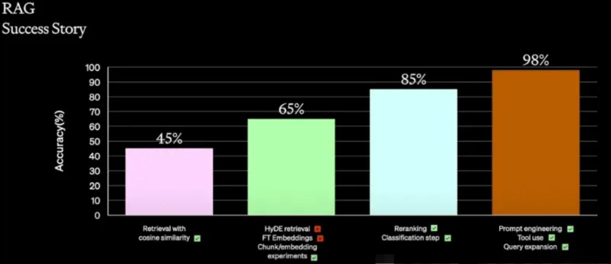
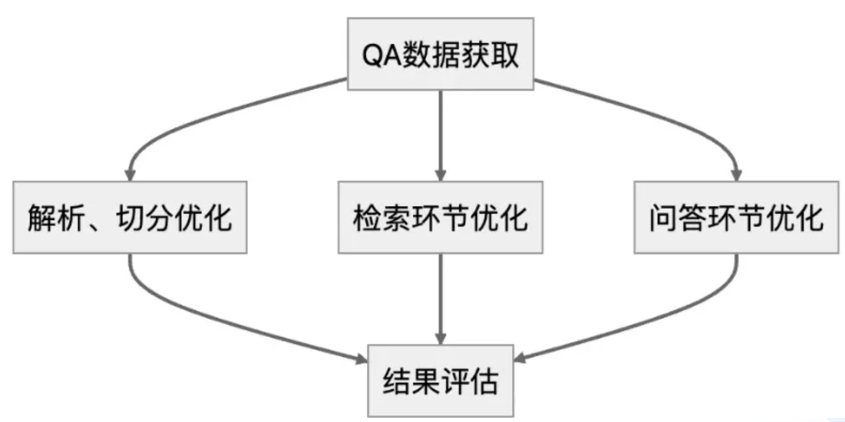
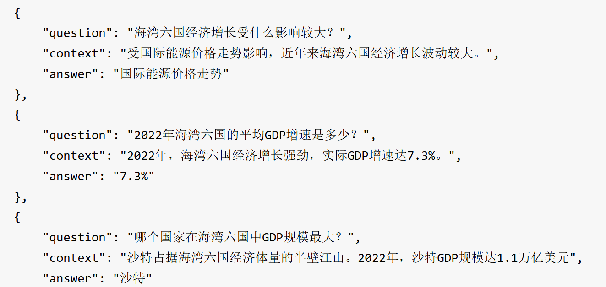

# 搭建简易问答机器人

### 概述

构建一个基础版的RAG是非常简单的，甚至使用扣子、Dify等平台，熟练的情况下都用不了5分钟，即使使用Langchain、LlamaIndex等框架，搭建完整流程，代码也不会超过100行。但基础版的问答效果往往较差。

下面这张图是OpenAI介绍的RAG优化经验，这个准确率当然随不同的数据集会有不同，但基本上优化后的准确率比优化前有显著提升这个基本上是一致的。



问答系统构建完成后，总的流程是先对文档进行解析、切分，然后使用问题检索相关知识片段，最后将问题和知识片段输入LLM，生成答案。

在构建的过程中也是一样的，这三个环节是可以分别独立优化的，如下图所示：



如何获取QA数据在RAG中十分重要，所谓的QA数据，就是“问题-回答”数据，理想情况下，如果包含回答所用到的文档片段是更好的。部分系统（如客服系统）是有这方面数据的，但绝大多数情况下是没有的，这时就需要首先构造一批问答数据，这是后续所有环节最重要的一步。

接下来将演示如何搭建一个简易的问答机器人。

### 环境、模型、问答库准备

#### 安装环境

先安装必要的依赖库：

```bash
pip install langchain unstructured transformers torch -i https://pypi.tuna.tsinghua.edu.cn/simple
```

```bash
pip install langchain_unstructured modelscope -i https://pypi.tuna.tsinghua.edu.cn/simple
```

在本案例中，使用的问答模型是Qwen2-0.5B-instruct，由于该模型的参数量较小，能力有限。

在显存足够的话，可以尝试其他参数量稍大一点的模型。

#### 下载模型

modelscope上提供了qwen2-0.5B-instruct的下载地址

国内下载速度也比较快。

首先创建一个目录用于存放模型

```bash
!mkdir qwen2-0.5-instruct
```

下载模型：

```bash
modelscope download --model Qwen/Qwen2.5-0.5B-Instruct --local_dir qwen2-0.5-instruct
```

#### 问答库

构造QA我们可以将问答内容存放在一个Txt文档中，方便后续环节的优化

对问题、上下文、答案的要求：  

问题要与这段文本相关，不要询问类似“这个问题的答案在哪一章”这样的问题
上下文：上下文必须与原始文本的内容保持一致，不要进行缩写、扩写、改写、摘要、替换词语等
答案：回答请保持完整且简洁，无须重复问题。答案要能够独立回答问题，而不是引用现有的章节、页码等

具体QA数据集的格式如下，大家也可以根据自己的偏好往QA库中添加一些其他的内容。



### 代码实现

导入依赖库：

```Python
import os
import torch
from langchain.text_splitter import RecursiveCharacterTextSplitter
from langchain.prompts import PromptTemplate
from langchain_unstructured import UnstructuredLoader
from transformers import AutoTokenizer, AutoModelForCausalLM
```

导入QA知识库并对其进行分割：

```Python
# 文本加载与分割

loader = UnstructuredLoader("/home/jiangsiyuan/Langchain-Chatchat/test.txt")
document = loader.load()
print(f'documents loaded: {len(document)}')


text_splitter = RecursiveCharacterTextSplitter(chunk_size=500, chunk_overlap=50)
split_documents = text_splitter.split_documents(document)
print(f'documents after split: {len(split_documents)}')
```

加载大模型：

```Python
# 加载 Qwen2 模型和分词器
model_path = "/home/jiangsiyuan/qwen2.5-0.5b"

tokenizer = AutoTokenizer.from_pretrained(model_path, trust_remote_code=True)
model = AutoModelForCausalLM.from_pretrained(
        model_path,
        trust_remote_code=True,
        torch_dtype="auto",
        device_map="auto"
    )

# 优化提示模板，确保简洁且直接
qa_template = """你是一个专家，根据用户提问给出精准的回答，精简内容，避免冗余：{context}
问题：{question}"""

QA_PROMPT = PromptTemplate(template=qa_template, input_variables=["context", "question"])
```

使用模型进行对话：

```Python
import os
import torch
from langchain.text_splitter import RecursiveCharacterTextSplitter
from langchain.prompts import PromptTemplate
from langchain_unstructured import UnstructuredLoader
from transformers import AutoTokenizer, AutoModelForCausalLM

# 文本加载与分割

loader = UnstructuredLoader("/home/jiangsiyuan/Langchain-Chatchat/test.txt")
document = loader.load()
print(f'documents loaded: {len(document)}')


text_splitter = RecursiveCharacterTextSplitter(chunk_size=500, chunk_overlap=50)
split_documents = text_splitter.split_documents(document)
print(f'documents after split: {len(split_documents)}')

# 加载 Qwen2 模型和分词器
model_path = "/home/jiangsiyuan/qwen2.5-0.5b"

tokenizer = AutoTokenizer.from_pretrained(model_path, trust_remote_code=True)
model = AutoModelForCausalLM.from_pretrained(
        model_path,
        trust_remote_code=True,
        torch_dtype="auto",
        device_map="auto"
    )


# 优化提示模板，确保简洁且直接
qa_template = """你是一个专家，根据用户提问给出精准的回答，精简内容，避免冗余：{context}
问题：{question}"""


QA_PROMPT = PromptTemplate(template=qa_template, input_variables=["context", "question"])

# 进入问答循环
print("进入问答模式，输入 '退出' 结束。")
while True:
    question = input("请输入问题：")
    if question.strip().lower() == "退出":
        break

    context = split_documents[0].page_content if split_documents else ""
   
    context = context[:500]
    prompt = QA_PROMPT.format(context=context, question=question)

    messages = [{"role": "user", "content": prompt}]
    text = tokenizer.apply_chat_template(
        messages,
        tokenize=False,
        add_generation_prompt=True,
        enable_thinking=False  
    )
    inputs = tokenizer([text], return_tensors="pt").to(model.device)


    try:
        generated_ids = model.generate(
            **inputs,
            max_new_tokens=256,  
            temperature=0.9,
            repetition_penalty=1.2,
            top_p=0.95,
            eos_token_id=tokenizer.eos_token_id,
            pad_token_id=tokenizer.eos_token_id
        )
        output_ids = generated_ids[0][inputs["input_ids"].shape[1]:].tolist()
        response = tokenizer.decode(output_ids, skip_special_tokens=True)
        
        answer = response.strip().split("回答：")[-1].strip() if "回答：" in response else response.strip()
        print("回答：", answer)
    except Exception as e:
        print(f"Error during generation: {e}")

```

结果如下：


从结果可以看出，模型的回答在一定程度上参考了知识库的知识进行问答的。