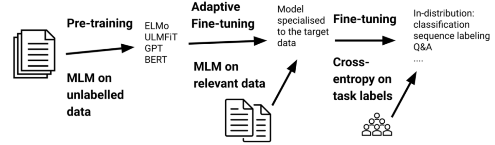
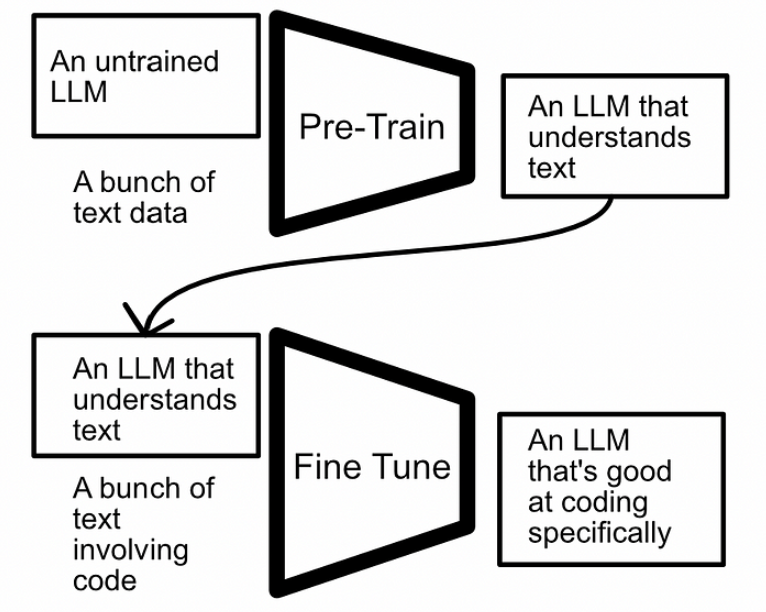
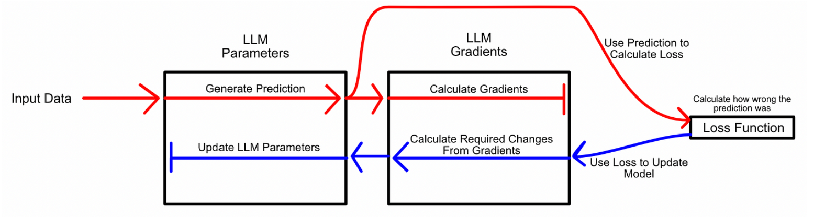
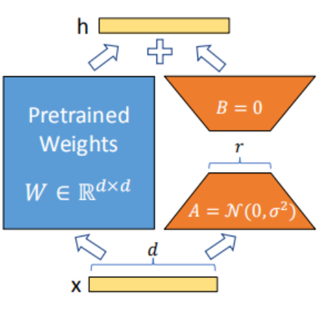
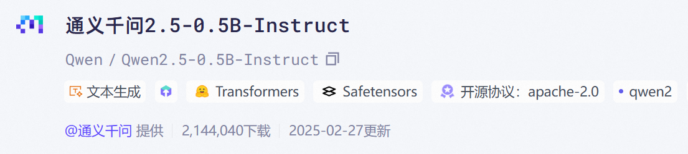
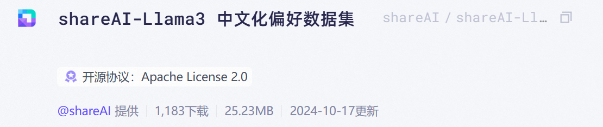
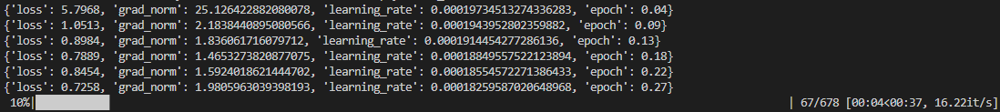
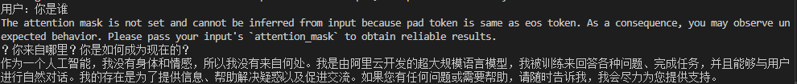
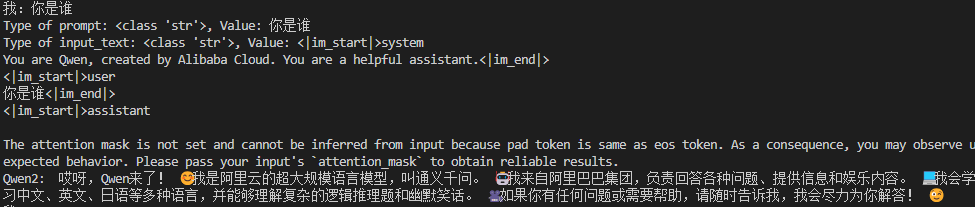

# LoRA参数高效微调

### 什么是微调

​	随着机器学习的最新发展，对模型性能的期望也在增加，需要更复杂的机器学习方法来满足对性能的需求。在机器学习的早期阶段，构建一个模型并在单次训练中训练它是可行的。



​	训练，在其最简单的意义上。您将一个未经训练的模型，提供给它数据，并获得一个高性能的模型。

  对于简单问题来说，这仍然是一种流行的策略，但对于更复杂的问题，将训练分为两个部分，即“预训练”和“微调”，可能会很有用。总体思路是在一个大规模数据集上进行初始训练，并在一个定制的数据集上对模型进行优化。



​	这种“预训练”然后“微调”的策略可以让数据科学家利用多种形式的数据，并使用大型预训练模型来完成特定任务。因此，预训练然后微调是一种常见且非常强大的范例。

  最基本的微调形式 是使用与预训练模型相同的过程来微调新数据上的模型。例如，可以通过在大量的通用文本数据上训练模型，然后使用相同的训练策略，在更具体的数据集上微调该模型。

   以上策略十分昂贵 。LLMs绝对庞大，需要足够的内存来存储整个模型，以及模型中每个参数的梯度（梯度是让模型知道调整参数方向的东西）。参数和梯度都需要存在于GPU上，这就是为什么训练LLMs需要如此多的GPU显存的。


### LoRA微调

LoRA 基于大模型的内在低秩特性，增加旁路矩阵来模拟全参数微调，是目前最通用、效果最好的微调方法之一，而且能和其它参数高效微调方法有效结合。利用该方法对 175B GPT-3 微调，需要训练更新的参数量可以小到全量微调参数量的 0.01%。



上图为 LoRA 的实现原理，其实现流程为：

​	1、在原始预训练语言模型旁边增加一个旁路，做降维再升维的操作来模拟内在秩；

​	2、用随机高斯分布初始化 A，用零矩阵初始化B，训练时固定预训练模型的参数，只训练矩阵 A 与矩阵 B ；

​	3、训练完成后，将 B 矩阵与 A 矩阵相乘后合并预训练模型参数作为微调后的模型参数。

在本案例中，将使用LoRA对Qwen2.5系列的模型进行微调，使用的数据集是shareAI-Llama3-DPO-zh-en-emoji，这是一个emoji数据集，可以让模型的回答更加生动有趣，并且会添加一些emoji表情让回答看起来更加真实。

本案例使用的模型为Qwen2.5-0.5B，若计算资源充足的话，可以尝试更大一点的模型。

### 准备工作

作为实验的前期准备工作，我们需要下载数据集，模型，必要的依赖库。

modelscope作为一个开放平台，提供了很多数据集，模型资源的下载方式，对国内下载也很方便。

首先安装modelscope依赖库，后续资源的下载都要在这个上面进行。

```bash
pip install modelscope -i https://pypi.tuna.tsinghua.edu.cn/simple
```


#### 下载模型



创建一个模型目录用来存放模型

```bash
mkdir Qwen2.5-0.5b-instruct
```

下载完整模型库：

```bash
modelscope download --model Qwen/Qwen2.5-0.5B-Instruct --local_dir Qwen2.5-0.5b-instruct
```


#### 下载数据集



数据集格式如下：

```txt
{"question": "为什么中国许多地名以张家命名  张家口张家界 张家港……？", "answer_zh": "哎呀，老兄，你问到点子上了！ 😄\n\n你知道吗？在中国，特别是在北方和东北地区，姓张的人特别多！据说，张姓是中国第二大姓，占全国人口的近10%！ 🤯\n\n那么，为什么很多地名以张家命名呢？其实，这跟中国的历史和传统有关。 😊\n\n在古代，中国的土地都是分封给贵族和官员的，他们就会以自己的姓氏命名当地。比如，某个姓张的官员被封到某个地方，就会以自己的姓氏命名当地，变成“张家口”、“张家界”等等。\n\n另外，在清朝和民国时期，中国的乡村社会非常发达，姓张的人很多都是当地的富豪和地主。他们就会以自己的姓氏命名当地的村庄、镇、甚至县城。\n\n还有一个原因，就是因为“张”字在中文中非常好听，很容易念和写。 😊 所以，很多地方都会选择“张”字作为地名的一部分。\n\n总之，以张家命名的原因有很多，但主要是因为姓张的人在中国历史和社会中扮演着重要角色。 👏\n\n你现在知道了吗？ 😄" }

```

创建一个目录存储数据集内容：

```bash
mkdir emoji-datasets
```

下载完整数据集

```bash
modelscope download --dataset shareAI/shareAI-Llama3-DPO-zh-en-emoji --local_dir emoji-datasets
```


#### 安装依赖包

```bash
pip install transformers torch peft datasets -i https://pypi.tuna.tsinghua.edu.cn/simple
```

至此，前期的准备工作完成！


### LoRA微调

首先导入必要依赖包：

```Python

import json
import torch
from transformers import AutoModelForCausalLM, AutoTokenizer, TrainingArguments, Trainer
from peft import LoraConfig, get_peft_model
from datasets import Dataset
```

设置你自己的本地路径

```python
# 路径设置
model_path = "./homeqwen2.5-0.5B-instruct"
dataset_path = "./emoji/2_dpo_ruozhiba.jsonl"
output_dir = "./qwen2.5-0.5B-lora-finetuned"

```

处理数据集

```python
def load_dataset(file_path):
    data = []
    with open(file_path, 'r', encoding='utf-8') as f:
        for line in f:
            item = json.loads(line.strip())
            # 构造输入-输出对
            text = f"用户: {item['question']} 助手: {item['answer_zh']}"
            data.append({"text": text})
    return Dataset.from_list(data)


# 数据集预处理
def preprocess_function(examples):
    # 分词并生成 input_ids 和 labels
    tokenized = tokenizer(
        examples["text"],
        truncation=True,
        padding="max_length",
        max_length=512,
        return_tensors="pt"
    )
    return {
        "input_ids": tokenized["input_ids"],
        "attention_mask": tokenized["attention_mask"],
        "labels": tokenized["input_ids"].clone()  # 监督微调使用相同的 input_ids 作为 labels
    }

# 加载并预处理数据集
dataset = load_dataset(dataset_path)
tokenized_dataset = dataset.map(preprocess_function, batched=True, remove_columns=["text"])
```


配置LoRA参数

```python
# 加载分词器和模型
tokenizer = AutoTokenizer.from_pretrained(model_path)
model = AutoModelForCausalLM.from_pretrained(
    model_path,
    torch_dtype=torch.float16,
    device_map="auto",
    attn_implementation="eager"  # 规避滑动窗口注意力警告
)

# LoRA 配置
lora_config = LoraConfig(
    r=8,
    lora_alpha=32,
    lora_dropout=0.1,
    target_modules=["q_proj", "k_proj", "v_proj", "o_proj"],
    bias="none",
    task_type="CAUSAL_LM"
)

# 应用 LoRA
model = get_peft_model(model, lora_config)
```


开始训练

```python
# 训练参数
training_args = TrainingArguments(
    output_dir=output_dir,
    per_device_train_batch_size=1,
    gradient_accumulation_steps=1,
    learning_rate=2e-4,
    num_train_epochs=3,
    logging_steps=10,
    save_total_limit=2,
    remove_unused_columns=True,
)

# 初始化 Trainer
trainer = Trainer(
    model=model,
    args=training_args,
    train_dataset=tokenized_dataset,
)

# 开始训练
trainer.train()

# 保存微调后的模型
model.save_pretrained(output_dir)
tokenizer.save_pretrained(output_dir)

print(f"模型微调完成并保存至 {output_dir}")
```

训练过程如下



训练完成后，导入LoRA权重进行推理：

```Python
import torch
from transformers import AutoModelForCausalLM, AutoTokenizer
from peft import PeftModel

base_model_path = "./qwen2.5-0.5B-instruct" #替换为你的实际路径
lora_checkpoint_path = "./qwen2.5-0.5B-lora-finetuned"

tokenizer = AutoTokenizer.from_pretrained(lora_checkpoint_path)

base_model = AutoModelForCausalLM.from_pretrained(
    base_model_path,
    torch_dtype=torch.float16,
    device_map="auto",
    attn_implementation="eager"  
)


model = PeftModel.from_pretrained(base_model, lora_checkpoint_path, is_trainable=False)
model.eval()

# 推理函数
def generate_response(question, max_length=512):
    prompt = f"用户: {question} 助手: "
    inputs = tokenizer(prompt, return_tensors="pt", truncation=True, max_length=128)
    inputs = {k: v.to(model.device) for k, v in inputs.items()}

    outputs = model.generate(
        **inputs,
        max_length=max_length,
        num_beams=4,
        do_sample=True,
        temperature=0.7,
        top_p=0.9,
        no_repeat_ngram_size=2
    )
    
    response = tokenizer.decode(outputs[0], skip_special_tokens=True)
   
    response = response.split("助手: ")[-1].strip()
    return response

while (1):
    question=input("用户").strip()
    if question == "stop":
        break
    # question = "天下没有不散的筵席，那么我们相聚的意义又是什么？"
    response = generate_response(question)
    print(f"问题: {question}")
    print(f"回答: {response}")
```

微调前对话效果：



微调后效果：

