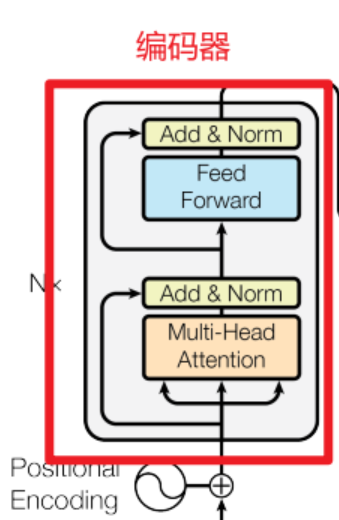

# Transformer代码实现机器翻译示例

在了解了Transformer的模型结构后，下面我们将动手实现Transformer的代码，并使用该模型来实现一个简单的机器翻译任务。

## 回顾Transformer


Transformer工作流程如下：

1. 输入处理：
   - 输入序列（如源语言句子）经过词嵌入（Word Embedding）和位置编码（Positional Encoding），转化为向量表示，位置编码为序列添加位置信息。
2. 编码器（Encoder）：
   - 输入向量进入编码器，编码器由多个相同层堆叠组成（通常6层）。
   - 每层包含两部分：
     - **多头自注意力（Multi-Head Self-Attention）：** 计算输入序列中各词之间的关系，捕捉全局依赖。
     - **前馈网络（Feed-Forward Network）：** 对每个位置独立进行非线性变换。
   - 每部分后接残差连接（Residual Connection）和层归一化（Layer Normalization），输出最终的上下文表示。
3. 解码器（Decoder）：
   - 目标序列（如目标语言句子）同样经过嵌入和位置编码，进入解码器（也由多层堆叠组成）。
   - 每层包含三部分：
     - **掩码多头自注意力（Masked Multi-Head Self-Attention）：** 处理目标序列，确保只关注之前的位置（适合生成任务）。
     - **编码器-解码器注意力（Encoder-Decoder Attention）：** 利用编码器输出，关注输入序列的相关部分。
     - **前馈网络：** 与编码器类似，进行独立变换。
   - 同样每部分后有残差连接和层归一化。
4. 输出生成：
   - 解码器输出经过线性层和Softmax，预测下一个词的概率分布。
   - 在训练时，使用目标序列直接计算损失；在推理时，逐步生成输出序列。

## 动手实现Transformer

### 1、数据准备

在开始之前先确保必要的依赖包已安装：

```bash
! pip install torch -i https://pypi.tuna.tsinghua.edu.cn/simple
! pip install numpy -i https://pypi.tuna.tsinghua.edu.cn/simple
```

**导入依赖包**

```python
import math
import torch
import numpy as np
import torch.nn as nn
import torch.optim as optim
import torch.utils.data as Data
```

**自制数据集**

```python
# 自制数据集
#正确设定EG：     Encoder_input    Decoder_input        Decoder_output
sentences = [['我 是 学 生 P', 'S I am a student', 'I am a student E'],  # S: 开始符号
             ['我 喜 欢 学 习', 'S I like learning P', 'I like learning P E'],  # E: 结束符号
             ['我 是 男 生 P', 'S I am a boy', 'I am a boy E'],# P: 占位符号，如果当前句子不足固定长度用P占位 pad补0
             ['ils regardent . P P','S they are watching .','they are watching . E']]

src_idx2word = {src_vocab[key]: key for key in src_vocab}
src_vocab_size = len(src_vocab)  # 字典字的个数

tgt_vocab = {'S': 0, 'E': 1, 'P': 2, 'I': 3, 'am': 4, 'a': 5, 'student': 6, 'like': 7, 'learning': 8, 'boy': 9,'they':10,'are':11,'watching':12,'.':13}
idx2word = {tgt_vocab[key]: key for key in tgt_vocab}  # 把目标字典转换成 索引：字的形式
tgt_vocab_size = len(tgt_vocab)  # 目标字典尺寸

src_len = len(sentences[0][0].split(" "))  # Encoder输入的最大长度 5
tgt_len = len(sentences[0][1].split(" "))  # Decoder输入输出最大长度 5

print("Encoder Decoder 最大输入输出长度为",src_len, tgt_len)
```

sentences列表包含四组句子，每组包括三部分：源语言输入（Encoder_input，如“我 是 学 生 P”）、解码器输入（Decoder_input，如“S I am a student”）和解码器输出（Decoder_output，如“I am a student E”），其中“S”表示开始符号，“E”表示结束符号，“P”用作占位符补齐长度。

src_vocab和tgt_vocab分别是源语言和目标语言的词典，src_idx2word和idx2word将词典转换为索引到词的映射，计算词典大小（src_vocab_size和tgt_vocab_size）。src_len和tgt_len分别定义Encoder和Decoder的最大输入长度（均为5），用于后续模型处理。

**把sentences 转换成字典索引**

```python
def make_data(sentences):
    enc_inputs, dec_inputs, dec_outputs = [], [], []
    for i in range(len(sentences)):
        enc_input = [[src_vocab[n] for n in sentences[i][0].split()]]
        dec_input = [[tgt_vocab[n] for n in sentences[i][1].split()]]
        dec_output = [[tgt_vocab[n] for n in sentences[i][2].split()]]
        enc_inputs.extend(enc_input)
        dec_inputs.extend(dec_input)
        dec_outputs.extend(dec_output)
    return torch.LongTensor(enc_inputs), torch.LongTensor(dec_inputs), torch.LongTensor(dec_outputs)


enc_inputs, dec_inputs, dec_outputs = make_data(sentences)
print(enc_inputs.shape, dec_inputs.shape, dec_outputs.shape)


print(enc_inputs)
print(dec_inputs)
print(dec_outputs)
```

这段代码定义并实现了一个函数 make_data，用于将前面定义的 sentences 数据集转换为Transformer模型所需的张量格式输入，同时展示了生成结果的形状和内容。

运行这段代码会得到以下输出：

```python
torch.Size([4, 5]) torch.Size([4, 5]) torch.Size([4, 5])
tensor([[ 1,  2,  3,  4,  0],
        [ 1,  5,  6,  3,  7],
        [ 1,  2,  8,  4,  0],
        [ 9, 10, 11,  0,  0]])
tensor([[ 0,  3,  4,  5,  6],
        [ 0,  3,  7,  8,  2],
        [ 0,  3,  4,  5,  9],
        [ 0, 10, 11, 12, 13]])
tensor([[ 3,  4,  5,  6,  1],
        [ 3,  7,  8,  2,  1],
        [ 3,  4,  5,  9,  1],
        [10, 11, 12, 13,  1]])
```

可以得知Encoder的输入端，Decoder的输入输出端的数据都是一个4x5的矩阵。

自定义数据集函数

```python
class MyDataSet(Data.Dataset):
    def __init__(self, enc_inputs, dec_inputs, dec_outputs):
        super(MyDataSet, self).__init__()
        self.enc_inputs = enc_inputs
        self.dec_inputs = dec_inputs
        self.dec_outputs = dec_outputs

    def __len__(self):
        return self.enc_inputs.shape[0]

    def __getitem__(self, idx):
        return self.enc_inputs[idx], self.dec_inputs[idx], self.dec_outputs[idx]
    
loader = Data.DataLoader(MyDataSet(enc_inputs, dec_inputs, dec_outputs), 2, True)
```

这段代码定义了一个自定义数据集类 MyDataSet，继承自 PyTorch 的 Data.Dataset，用于将Transformer模型的编码器输入、解码器输入和解码器输出封装为数据集，并通过 Data.DataLoader 创建数据加载器。__init__ 方法初始化数据集，存储输入和输出张量；__len__ 方法返回数据集大小（样本数）；__getitem__ 方法根据索引返回单个样本的数据元组。loader 使用该数据集，以批次大小为2且启用随机打乱（shuffle=True）的方式加载数据，方便后续模型训练时按批次读取数据。

至此，数据集的准备已经完成。

### 2、Transformer模型构建

#### **掩码矩阵**

“防止模型偷看答案”

```python
def get_attn_subsequence_mask(seq):  # seq: [batch_size, tgt_len]
    attn_shape = [seq.size(0), seq.size(1), seq.size(1)]  # 生成上三角矩阵,[batch_size, tgt_len, tgt_len]
    subsequence_mask = np.triu(np.ones(attn_shape), k=1)
    subsequence_mask = torch.from_numpy(subsequence_mask).byte()  # [batch_size, tgt_len, tgt_len]
    return subsequence_mask

```

#### **缩放点积注意力：**

通过计算查询（Query）和键（Key）的点积，再除以√dk（键的维度）来防止梯度消失问题，最后通过Softmax函数得到权重，对值（Value）进行加权求和。


```python
class ScaledDotProductAttention(nn.Module):
    def __init__(self):
        super(ScaledDotProductAttention, self).__init__()

    def forward(self, Q, K, V, attn_mask):  # Q: [batch_size, n_heads, len_q, d_k]
        # K: [batch_size, n_heads, len_k, d_k]
        # V: [batch_size, n_heads, len_v(=len_k), d_v]
        # attn_mask: [batch_size, n_heads, seq_len, seq_len]
        scores = torch.matmul(Q, K.transpose(-1, -2)) / np.sqrt(d_k)  # scores : [batch_size, n_heads, len_q, len_k]
        scores.masked_fill_(attn_mask, -1e9)  # 如果是停用词P就等于 0
        attn = nn.Softmax(dim=-1)(scores)
        context = torch.matmul(attn, V)  # [batch_size, n_heads, len_q, d_v]
        return context, attn
```

forward 方法接收查询（Q）、键（K）、值（V）和注意力掩码作为输入，计算步骤包括：首先通过矩阵乘法 torch.matmul(Q, K.transpose(-1, -2)) 计算Q和K的点积，并除以 sqrt(d_k) 进行缩放，得到注意力分数 scores（形状 [batch_size, n_heads, len_q, len_k]）；然后使用掩码将填充位置的分数置为负无穷（-1e9），避免对无效位置的关注；接着通过Softmax函数将分数转换为概率分布 attn，最后与V相乘得到上下文向量 context（形状 [batch_size, n_heads, len_q, d_v]）。


#### **多头注意力：**

将输入投影到多个子空间，分别计算注意力，最后将结果拼接并通过线性变换输出。这种方法增强了模型的表达能力


```python
class MultiHeadAttention(nn.Module):
    def __init__(self):
        super(MultiHeadAttention, self).__init__()
        self.W_Q = nn.Linear(d_model, d_k * n_heads, bias=False)
        self.W_K = nn.Linear(d_model, d_k * n_heads, bias=False)
        self.W_V = nn.Linear(d_model, d_v * n_heads, bias=False)
        self.fc = nn.Linear(n_heads * d_v, d_model, bias=False)

    def forward(self, input_Q, input_K, input_V, attn_mask):  # input_Q: [batch_size, len_q, d_model]
        # input_K: [batch_size, len_k, d_model]
        # input_V: [batch_size, len_v(=len_k), d_model]
        # attn_mask: [batch_size, seq_len, seq_len]
        residual, batch_size = input_Q, input_Q.size(0)
        Q = self.W_Q(input_Q).view(batch_size, -1, n_heads, d_k).transpose(1, 2)  # Q: [batch_size, n_heads, len_q, d_k]
        K = self.W_K(input_K).view(batch_size, -1, n_heads, d_k).transpose(1, 2)  # K: [batch_size, n_heads, len_k, d_k]
        V = self.W_V(input_V).view(batch_size, -1, n_heads, d_v).transpose(1,
                                                                           2)  # V: [batch_size, n_heads, len_v(=len_k), d_v]
        attn_mask = attn_mask.unsqueeze(1).repeat(1, n_heads, 1,
                                                  1)  # attn_mask : [batch_size, n_heads, seq_len, seq_len]
        context, attn = ScaledDotProductAttention()(Q, K, V, attn_mask)  # context: [batch_size, n_heads, len_q, d_v]
        # attn: [batch_size, n_heads, len_q, len_k]
        context = context.transpose(1, 2).reshape(batch_size, -1,
                                                  n_heads * d_v)  # context: [batch_size, len_q, n_heads * d_v]
        output = self.fc(context)  # [batch_size, len_q, d_model]
        return nn.LayerNorm(d_model)(output + residual), attn
```

这段代码定义了 MultiHeadAttention 类，实现Transformer中的多头注意力机制。__init__ 方法初始化线性变换层（W_Q、W_K、W_V）将输入从 d_model 维度映射到多头形式的 d_k * n_heads 或 d_v * n_heads，以及一个输出线性层 fc；forward 方法接收查询、键、值和注意力掩码。

通过线性变换和维度重塑生成多头形式的Q、K、V，调用 ScaledDotProductAttention 计算每头的注意力输出 context，再将多头结果拼接并通过线性层恢复到 d_model 维度，最后结合残差连接和层归一化返回结果及注意力权重 attn。

#### **逐位置前馈网络和注意力掩码**

```python
class PoswiseFeedForwardNet(nn.Module):
    def __init__(self):
        super(PoswiseFeedForwardNet, self).__init__()
        self.fc = nn.Sequential(
            nn.Linear(d_model, d_ff, bias=False),
            nn.ReLU(),
            nn.Linear(d_ff, d_model, bias=False))

    def forward(self, inputs):  # inputs: [batch_size, seq_len, d_model]
        residual = inputs
        output = self.fc(inputs)
        return nn.LayerNorm(d_model)(output + residual)  # [batch_size, seq_len, d_model]


def get_attn_pad_mask(seq_q, seq_k):
    batch_size, len_q = seq_q.size()  # seq_q 用于升维，为了做attention，mask score矩阵用的
    batch_size, len_k = seq_k.size()
    pad_attn_mask = seq_k.data.eq(0).unsqueeze(1)  # 判断 输入那些含有P(=0),用1标记 ,[batch_size, 1, len_k]
    return pad_attn_mask.expand(batch_size, len_q, len_k)  # 扩展成多维度   [batch_size, len_q, len_k]
```

PoswiseFeedForwardNet 类定义了逐位置前馈网络，通过两个线性层（d_model 到 d_ff 再回到 d_model）和ReLU激活函数处理输入，并结合残差连接和层归一化输出相同形状的结果，增强模型的非线性表达能力；get_attn_pad_mask 函数生成注意力掩码，用于屏蔽序列中填充符（如“P”对应的索引0），通过比较 seq_k 是否为0生成掩码张量，确保注意力机制忽略填充位置，提升计算效率和准确性。

#### **Transformer位置编码**


```python
class PositionalEncoding(nn.Module):
    def __init__(self, d_model, dropout=0.1, max_len=5000):
        super(PositionalEncoding, self).__init__()
        self.dropout = nn.Dropout(p=dropout)
        pos_table = np.array([
            [pos / np.power(10000, 2 * i / d_model) for i in range(d_model)]
            if pos != 0 else np.zeros(d_model) for pos in range(max_len)])
        pos_table[1:, 0::2] = np.sin(pos_table[1:, 0::2])  # 字嵌入维度为偶数时
        pos_table[1:, 1::2] = np.cos(pos_table[1:, 1::2])  # 字嵌入维度为奇数时
        self.pos_table = torch.FloatTensor(pos_table)  # enc_inputs: [seq_len, d_model]

    def forward(self, enc_inputs):  # enc_inputs: [batch_size, seq_len, d_model]
        enc_inputs += self.pos_table[:enc_inputs.size(1), :]
        return self.dropout(enc_inputs)
```

这段代码定义了 PositionalEncoding 类，实现Transformer中的位置编码功能，用于为输入序列添加位置信息。__init__ 方法初始化一个位置编码表 pos_table，通过正弦和余弦函数（偶数维度用sin，奇数维度用cos）计算每个位置的编码值，公式基于位置 pos 和维度 i 的指数衰减（pos / 10000^(2i/d_model)），并设置dropout层；forward 方法将预计算的位置编码表截取到输入序列长度，加到输入 enc_inputs上，最后应用dropout，返回带有位置信息的编码结果，解决了Transformer缺乏序列顺序信息的问题。

#### **Encoder**




```python
class EncoderLayer(nn.Module):
    def __init__(self):
        super(EncoderLayer, self).__init__()
        self.enc_self_attn = MultiHeadAttention()  # 多头注意力机制
        self.pos_ffn = PoswiseFeedForwardNet()  # 前馈神经网络

    def forward(self, enc_inputs, enc_self_attn_mask):  # enc_inputs: [batch_size, src_len, d_model]
        # 输入3个enc_inputs分别与W_q、W_k、W_v相乘得到Q、K、V                          # enc_self_attn_mask: [batch_size, src_len, src_len]
        enc_outputs, attn = self.enc_self_attn(enc_inputs, enc_inputs, enc_inputs,
                                               # enc_outputs: [batch_size, src_len, d_model],
                                               enc_self_attn_mask)  # attn: [batch_size, n_heads, src_len, src_len]
        enc_outputs = self.pos_ffn(enc_outputs)  # enc_outputs: [batch_size, src_len, d_model]
        return enc_outputs, attn


class Encoder(nn.Module):
    def __init__(self):
        super(Encoder, self).__init__()
        self.src_emb = nn.Embedding(src_vocab_size, d_model)
        self.pos_emb = PositionalEncoding(d_model)
        self.layers = nn.ModuleList([EncoderLayer() for _ in range(n_layers)])

    def forward(self, enc_inputs):
        '''
        enc_inputs: [batch_size, src_len]
        '''
        enc_outputs = self.src_emb(enc_inputs)  # [batch_size, src_len, d_model]
        enc_outputs = self.pos_emb(enc_outputs.transpose(0, 1)).transpose(0, 1)  # [batch_size, src_len, d_model]
        enc_self_attn_mask = get_attn_pad_mask(enc_inputs, enc_inputs)  # [batch_size, src_len, src_len]
        enc_self_attns = []
        for layer in self.layers:
            # enc_outputs: [batch_size, src_len, d_model], enc_self_attn: [batch_size, n_heads, src_len, src_len]
            enc_outputs, enc_self_attn = layer(enc_outputs, enc_self_attn_mask)
            enc_self_attns.append(enc_self_attn)
        return enc_outputs, enc_self_attns
```

这段代码定义了Transformer的编码器部分，包括 EncoderLayer 和 Encoder 两个类。EncoderLayer 类实现编码器单层，包含多头自注意力机制和逐位置前馈网络，forward 方法接收输入 enc_inputs和自注意力掩码，依次通过自注意力计算和前馈网络处理，返回编码输出和注意力权重。Encoder 类是整个编码器，由词嵌入层（src_emb）、位置编码（PositionalEncoding）和多层编码层（n_layers 个 EncoderLayer）组成，forward 方法将输入 enc_inputs转为嵌入表示，添加位置编码，生成注意力掩码后，通过各层依次处理，最终输出编码结果 enc_outputs和所有层的注意力权重列表 enc_self_attns，实现了输入序列到上下文表示的转换。

#### Decoder

```python

class DecoderLayer(nn.Module):
    def __init__(self):
        super(DecoderLayer, self).__init__()
        self.dec_self_attn = MultiHeadAttention()
        self.dec_enc_attn = MultiHeadAttention()
        self.pos_ffn = PoswiseFeedForwardNet()

    def forward(self, dec_inputs, enc_outputs, dec_self_attn_mask,
                dec_enc_attn_mask):  # dec_inputs: [batch_size, tgt_len, d_model]
        # enc_outputs: [batch_size, src_len, d_model]
        # dec_self_attn_mask: [batch_size, tgt_len, tgt_len]
        # dec_enc_attn_mask: [batch_size, tgt_len, src_len]
        dec_outputs, dec_self_attn = self.dec_self_attn(dec_inputs, dec_inputs,
                                                        dec_inputs,
                                                        dec_self_attn_mask)  # dec_outputs: [batch_size, tgt_len, d_model]
        # dec_self_attn: [batch_size, n_heads, tgt_len, tgt_len]
        dec_outputs, dec_enc_attn = self.dec_enc_attn(dec_outputs, enc_outputs,
                                                      enc_outputs,
                                                      dec_enc_attn_mask)  # dec_outputs: [batch_size, tgt_len, d_model]
        # dec_enc_attn: [batch_size, h_heads, tgt_len, src_len]
        dec_outputs = self.pos_ffn(dec_outputs)  # dec_outputs: [batch_size, tgt_len, d_model]
        return dec_outputs, dec_self_attn, dec_enc_attn


class Decoder(nn.Module):
    def __init__(self):
        super(Decoder, self).__init__()
        self.tgt_emb = nn.Embedding(tgt_vocab_size, d_model)
        self.pos_emb = PositionalEncoding(d_model)
        self.layers = nn.ModuleList([DecoderLayer() for _ in range(n_layers)])

    def forward(self, dec_inputs, enc_inputs, enc_outputs):
        '''
        dec_inputs: [batch_size, tgt_len]
        enc_intpus: [batch_size, src_len]
        enc_outputs: [batch_size, src_len, d_model]
        '''
        dec_outputs = self.tgt_emb(dec_inputs)  # [batch_size, tgt_len, d_model]
        dec_outputs = self.pos_emb(dec_outputs.transpose(0, 1)).transpose(0, 1)  # [batch_size, tgt_len, d_model]
        # Decoder输入序列的pad mask矩阵（这个例子中decoder是没有加pad的，实际应用中都是有pad填充的）
        dec_self_attn_pad_mask = get_attn_pad_mask(dec_inputs, dec_inputs)  # [batch_size, tgt_len, tgt_len]
        # Masked Self_Attention：当前时刻是看不到未来的信息的
        dec_self_attn_subsequence_mask = get_attn_subsequence_mask(dec_inputs)  # [batch_size, tgt_len, tgt_len]
        # Decoder中把两种mask矩阵相加（既屏蔽了pad的信息，也屏蔽了未来时刻的信息）
        dec_self_attn_mask = torch.gt((dec_self_attn_pad_mask + dec_self_attn_subsequence_mask),
                                      0)  # [batch_size, tgt_len, tgt_len]

        # 这个mask主要用于encoder-decoder attention层
        # get_attn_pad_mask主要是enc_inputs的pad mask矩阵(因为enc是处理K,V的，求Attention时是用v1,v2,..vm去加权的，
        # 要把pad对应的v_i的相关系数设为0，这样注意力就不会关注pad向量)
        #                       dec_inputs只是提供expand的size的
        dec_enc_attn_mask = get_attn_pad_mask(dec_inputs, enc_inputs)  # [batc_size, tgt_len, src_len]

        dec_self_attns, dec_enc_attns = [], []
        for layer in self.layers:
            # dec_outputs: [batch_size, tgt_len, d_model], dec_self_attn: [batch_size, n_heads, tgt_len, tgt_len], dec_enc_attn: [batch_size, h_heads, tgt_len, src_len]
            dec_outputs, dec_self_attn, dec_enc_attn = layer(dec_outputs, enc_outputs, dec_self_attn_mask,
                                                             dec_enc_attn_mask)
            dec_self_attns.append(dec_self_attn)
            dec_enc_attns.append(dec_enc_attn)
        return dec_outputs, dec_self_attns, dec_enc_attns
```

DecoderLayer 类实现解码器单层，包含掩码多头自注意力、编码器-解码器注意力和逐位置前馈网络，forward 方法接收解码器输入 dec_inputs、编码器输出 enc_outputs 及两种掩码，依次通过自注意力关注已有输出、编码器-解码器注意力关联输入序列、前馈网络处理，返回解码输出和两种注意力权重。Decoder 类是整个解码器，由目标词嵌入层（tgt_emb）、位置编码（pos_emb）和多层解码层组成，forward 方法将输入 dec_inputs 转为嵌入表示，添加位置编码，生成掩码（包括填充掩码和子序列掩码以屏蔽未来信息），通过各层处理后输出解码结果 dec_outputs及自注意力和编码-解码注意力的权重列表，实现了目标序列的逐步生成。


#### Transformer

```python
class Transformer(nn.Module):
    def __init__(self):
        super(Transformer, self).__init__()
        self.Encoder = Encoder()
        self.Decoder = Decoder()
        self.projection = nn.Linear(d_model, tgt_vocab_size, bias=False)

    def forward(self, enc_inputs, dec_inputs):  # enc_inputs: [batch_size, src_len]
        # dec_inputs: [batch_size, tgt_len]
        enc_outputs, enc_self_attns = self.Encoder(enc_inputs)  # enc_outputs: [batch_size, src_len, d_model],
        # enc_self_attns: [n_layers, batch_size, n_heads, src_len, src_len]
        dec_outputs, dec_self_attns, dec_enc_attns = self.Decoder(
            dec_inputs, enc_inputs, enc_outputs)  # dec_outpus    : [batch_size, tgt_len, d_model],
        # dec_self_attns: [n_layers, batch_size, n_heads, tgt_len, tgt_len],
        # dec_enc_attn  : [n_layers, batch_size, tgt_len, src_len]
        dec_logits = self.projection(dec_outputs)  # dec_logits: [batch_size, tgt_len, tgt_vocab_size]
        return enc_outputs, dec_logits.view(-1, dec_logits.size(-1))
```

这段代码整合了编码器（Encoder）、解码器（Decoder）和输出投影层（projection），实现从输入序列到目标序列的端到端转换。__init__ 方法初始化编码器、解码器和一个线性层（将 d_model 维度映射到目标词表大小 tgt_vocab_size）；forward 方法接收编码器输入 enc_inputs和解码器输入 dec_inputs，首先通过编码器生成上下文表示 enc_outputs 和自注意力权重 enc_self_attns，然后通过解码器 enc_outputs 生成解码输出和自注意力权重 enc_self_attns；然后将这些结果传入解码器，结合 dec_inputs 生成解码输出 dec_outputs 及两种注意力权重；最后通过投影层将 dec_outputs 转换为预测 logits，返回编码器输出和展平的解码器预测结果，用于序列到序列任务（如翻译）的训练或推理。

### 3、训练并验证Transforer

#### 训练Transforer

```python
model = Transformer()
criterion = nn.CrossEntropyLoss(ignore_index=0)  # 忽略 占位符 索引为0.
optimizer = optim.SGD(model.parameters(), lr=1e-3, momentum=0.99)

for epoch in range(20):
    for enc_inputs, dec_inputs, dec_outputs in loader:
        enc_outputs, outputs = model(enc_inputs, dec_inputs)
        loss = criterion(outputs, dec_outputs.view(-1))
        print('Epoch:', '%04d' % (epoch + 1), 'loss =', '{:.6f}'.format(loss))
        optimizer.zero_grad()
        loss.backward()
        optimizer.step()

# 训练完成后保存模型参数
torch.save(model.state_dict(), 'transformer_model.pth')
print("Model saved to 'transformer_model.pth'")
```

首先生成一个 Transformer 模型实例 model，定义交叉熵损失函数 criterion（忽略索引为0的占位符，如“P”），并使用SGD优化器 optimizer（学习率为0.001，动量为0.99）优化模型参数。训练循环运行20个epoch，在每个epoch中，通过数据加载器 loader 遍历批次数据，调用模型前向传播得到编码器输出 enc_outputs 和预测结果 outputs，计算预测与真实输出之间的损失 loss，打印损失值，然后通过梯度清零、反向传播和参数更新完成一次优化迭代，从而逐步训练模型以最小化预测误差。

训练过程如下：

```bash
Epoch: 0001 loss = 2.844648
Epoch: 0001 loss = 2.870994
Epoch: 0002 loss = 2.832358
Epoch: 0002 loss = 2.486953
Epoch: 0003 loss = 2.097298
Epoch: 0003 loss = 2.043811
Epoch: 0004 loss = 1.883117
Epoch: 0004 loss = 1.299334
Epoch: 0005 loss = 1.255208
Epoch: 0005 loss = 1.211789
Epoch: 0006 loss = 0.887605
Epoch: 0006 loss = 0.825662
Epoch: 0007 loss = 0.527546
Epoch: 0007 loss = 0.592651
Epoch: 0008 loss = 0.387869
Epoch: 0008 loss = 0.381761
Epoch: 0009 loss = 0.318402
Epoch: 0009 loss = 0.170125
Epoch: 0010 loss = 0.243786
Epoch: 0010 loss = 0.163550
Epoch: 0011 loss = 0.148023
Epoch: 0011 loss = 0.136953
Epoch: 0012 loss = 0.096307
Epoch: 0012 loss = 0.161991
Epoch: 0013 loss = 0.118607
Epoch: 0013 loss = 0.087372
Epoch: 0014 loss = 0.107019
Epoch: 0014 loss = 0.060781
Epoch: 0015 loss = 0.036520
Epoch: 0015 loss = 0.092393
Epoch: 0016 loss = 0.055994
Epoch: 0016 loss = 0.031899
Epoch: 0017 loss = 0.032480
Epoch: 0017 loss = 0.061520
Epoch: 0018 loss = 0.038285
Epoch: 0018 loss = 0.033109
Epoch: 0019 loss = 0.041221
Epoch: 0019 loss = 0.015905
Epoch: 0020 loss = 0.041472
Epoch: 0020 loss = 0.021326
Model saved to 'transformer_model.pth'
```

可以看到在训练过程中，模型很快就达到了收敛（由于数据集比较小，训练速度比较快）

可以通过尝试更大的数据集来训练模型，提高模型的泛化能力。

#### 验证模型

```python
def test(model, enc_input, start_symbol):
    enc_outputs, enc_self_attns = model.Encoder(enc_input)
    dec_input = torch.zeros(1, tgt_len).type_as(enc_input.data)
    next_symbol = start_symbol
    for i in range(0, tgt_len):
        dec_input[0][i] = next_symbol
        dec_outputs, _, _ = model.Decoder(dec_input, enc_input, enc_outputs)
        projected = model.projection(dec_outputs)
        prob = projected.squeeze(0).max(dim=-1, keepdim=False)[1]
        next_word = prob.data[i]
        next_symbol = next_word.item()
    return dec_input

# 预测部分：加载模型并进行预测
# 创建一个新的模型实例
loaded_model = Transformer()
# 加载保存的参数
loaded_model.load_state_dict(torch.load('transformer_model.pth'))
loaded_model.eval()  # 设置为评估模式，禁用 dropout 等训练特定层
print("Model loaded from 'transformer_model.pth'")

# 获取测试数据并进行预测
enc_inputs, _, _ = next(iter(loader))
predict_dec_input = test(loaded_model, enc_inputs[1].view(1, -1), start_symbol=tgt_vocab["S"])
_, predict = loaded_model(enc_inputs[1].view(1, -1), predict_dec_input)
predict = predict.data.max(1, keepdim=True)[1]
print([src_idx2word[int(i)] for i in enc_inputs[1]], '->', [idx2word[n.item()] for n in predict.squeeze()])
```

首先通过编码器对输入 enc_input 生成上下文表示 enc_outputs；然后初始化解码器输入 dec_input 为全零张量，以开始符号（如“S”）启动生成，逐步预测每个位置的词（通过投影层 projected 获取概率分布并取最大值索引 next_symbol），直到达到目标长度 tgt_len，返回生成的序列。主代码从数据加载器中取出一个样本 enc_inputs[1]，调用 test 函数生成预测输入 predict_dec_input，再通过模型前向传播得到最终预测结果 predict，最后将索引转换为词并打印。

效果如下

```bash
Model loaded from 'transformer_model.pth'
['我', '喜', '欢', '学', '习'] -> ['I', 'like', 'learning', 'P', 'E']
```

