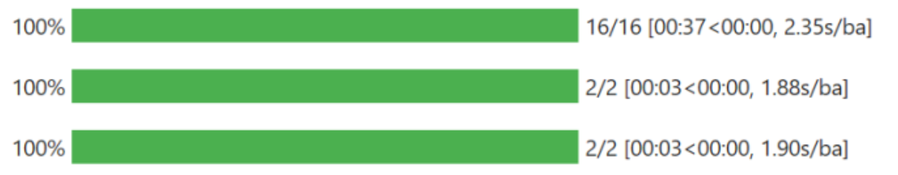

# 使用数据集微调一个Transformer模型

​	将通过 NLP 中最常见的文本分类任务来学习如何在自己的数据集上利用迁移学习（transfer learning）微调一个预训练的 Transformer 模型—— DistilBERT。DistilBERT 是 BERT 的一个衍生版本，它的优点在它的性能与 BERT 相当，但是体积更小、更高效。所以我们可以在几分钟内训练一个文本分类器。

在正式开始前先安装一些必要的依赖库：

```bash
#安装摩达库
!pip install modelscope -i https://pypi.tuna.tsinghua.edu.cn/simple
!pip install torch transformers numpy datasets pandas matplotlib scikit-learn -i https://pypi.tuna.tsinghua.edu.cn/simple
!pip install accelerate==0.26.0 -i https://pypi.tuna.tsinghua.edu.cn/simple
```


## 数据集

这里我们将使用英文推文情感数据集，这个数据集中包含了：anger，disgust，fear，joy，sadness 和 surprise 六种情感类别。

http://dx.doi.org/10.18653/v1/D18-1404

所以我们的任务是给定一段推文，训练一个可以将其分类成这六种基本情感的其中之一的模型。

现在我们来下载数据集。

摩达上提供了很多模型和数据集

```bash
#下载数据集
!modelscope download --dataset jieshenai/dair-ai_emotion --local_dir emotion
```

数据集下载完成后，可以通过load_dataset()方法来导入数据集，并将数据集打包成datasetsDict格式。

**注意：数据集路径记得换成自己下载的数据集的路径：**

```python
from datasets import load_dataset, DatasetDict
from datasets import ClassLabel

# 定义数据路径 换成自己的数据集路径
data_dir = "/emotions/data"

# 加载数据集（自动处理 .jsonl.gz 文件）
emotions = load_dataset(
    "json",
    data_files={
        "train": f"{data_dir}/train.jsonl.gz",
        "validation": f"{data_dir}/validation.jsonl.gz",
        "test": f"{data_dir}/test.jsonl.gz",
    },
)
label_names = ["sadness", "joy", "love", "anger", "fear", "surprise"]
emotions = emotions.cast_column("label", ClassLabel(names=label_names))
# 检查数据集结构
print(emotions ) 
```

输出结果如下：


通过下面代码可以看出数据集的结构是Text+label的格式

```python
train_ds=emotions["train"]
print(train_ds)
```


为了更好地分析数据，我们可以将 Dataset 对象转成 Pandas DataFrame，然后就可以利用各种高级 API 可视化数据集了。但是这种转换不会改变数据集的底层存储方式（这里是 Apache Arrow）。

```python
import pandas as pd
emotions.set_format(type='pandas')
df=emotions["train"][:]
print(df.head())

```


从上面可以看到 text 列中的推文在 label 列都有一个整数对应，显然这个整数和六种情绪是一一对应的。那么怎么去将整数映射成文本标签呢？

我们观察一下原始数据集中的每列的数据类型。

```python
print(train_ds.features)
```

```
{'text': Value(dtype='string', id=None), 
'label': ClassLabel(names=['sadness', 'joy', 'love', 'anger', 'fear', 'surprise'], id=None)}
```

我们发现 text 列就是普通的 string 类型，label 列是 ClassLabel 类型。ClassLabel 中包含了 names 属性，我们可以利用 ClassLabel 附带的 int2str 方法来将整数映射到文本标签。

```python
def label_int2str(row):
    return emotions["train"].features["label"].int2str(row)

df["label_name"]=df["label"].apply(label_int2str)
print(df.head())
```


现在看起来就清楚多了。

处理任何分类任务之前，都要看一下样本的类别分布是否均衡，不均衡类别分布的数据集在训练损失和评估指标方面可能需要与平衡数据集做不同的处理。

```python
import matplotlib.pyplot as plt
df["label_name"].value_counts(ascending=True).plot.barh()

plt.title("Frequency of emotions")
plt.show()
```


无论是哪个 Transformer 模型，它都有上下文长度限制（maximum context size）。GPT-4 Turbo 的上下文长度已经达到了 128k 个 token！不过 DistilBERT 只有 512。

token 指的是不能再被拆分的文本原子，我们将在后面学习，这里就简单理解为单词就好。

```python
df["Words Per Tweet"]= df["text"].str.split().apply(len)
df.boxplot("Words Per Tweet", by="label_name", grid=False, showfliers=False, color="black")
plt.suptitle("")
plt.xlabel("")
plt.show()
```


从上图可以看到最长的推文长度也没超过 512，大多数长度在 15 左右。完全符合 DistilBERT 的要求。比模型最长上下文限制还要长的文本需要被截断，如果截断的文本包含关键信息，这可能会导致性能损失，不过我们这里没有这个问题。

分析完数据集之后，别忘了将数据集格式从 DataFrame 转回来。

```python
df["Words Per Tweet"]= df["text"].str.split().apply(len)
df.boxplot("Words Per Tweet", by="label_name", grid=False, showfliers=False, color="black")
plt.suptitle("")
plt.xlabel("")
plt.show()
#转换格式
emotions.reset_format()
```

## 处理token

像 DistilBERT 这样的 Transformer 模型无法接受原始的字符串作为输入，我们必须将文本拆分成一个个 token（这一过程称为 tokenized），然后编码成数值向量表示。

将文本拆分成模型可用的原子单位的步骤称为 tokenization。对于英文来说有 character tokenization 和 word tokenization。我们这里简单地见识一下，不深入探讨。

以英文为例，对于 character tokenization 来说。

将原始文本拆分成一个个字符，也就是 26 个大小写字母加标点符号。

建立一个字符到唯一整数映射的映射关系表。

将字符映射到唯一的整数表示 input_ids。

将 input_ids 转成 2D 的 one-hot encoding 向量。


将原始文本拆分成字符

```python
text ="Tokenizing text is a core task of NLP."
tokenized_text = list(text)
print(tokenized_text)
```


字符到整数的映射关系

```python
token2idx = {ch: idx for idx, ch in enumerate(sorted(set(tokenized_text)))}
print(token2idx)
```


字符映射到唯一整数

```python
input_ids =[token2idx[token] for token in tokenized_text]
print(input_ids)
```


2D one-hot向量

```python
import torch
import torch.nn.functional as F
input_ids = torch.tensor(input_ids)
one_hot_encodings =F.one_hot(input_ids, num_classes=len(token2idx))
print(one_hot_encodings.shape) #torch.Size([38, 20])
```

character-level tokenization 忽略了文本的结构，将字符串看成是一连串的字符流，尽管这种方法可以处理拼写错误和罕见的单词。其主要缺点是需要从数据中学习单词等语言结构。这需要大量的计算、内存和数据。因此，这种方法在实践中很少使用。

word tokenization 就是按照单词维度来拆分文本。

```python
tokenized_text = text.split()
print(tokenized_text) 
#['Tokenizing', 'text', 'is', 'a', 'core', 'task', 'of', 'NLP.']
```

其余步骤和 character tokenization 都一样。不过 character tokenization 的词汇表最多只有几百个（对英文来说，26 个大小写字母和标点符号）。但是 word tokenziation 形成的词汇表可能有数千甚至数万之多，尤其是英文这种每个单词还有不同的形式变化的语言。

subword tokenization 可以看成是 character tokenization 和 word tokenization 的折中方法。

NLP 中有不少算法可以实现 subword tokenization，BERT 和 DistilBERT 都是采用 WordPiece 算法。

每个模型都有自己 tokenization 方法，所以要从对应模型的 checkpoint 下载预训练过的 tokenizer。

依旧从摩达上下载模型的权重参数以及一些配置文件：

​	先新建一个distillbert文件夹来存储文件，然后指定下载路径

```bash
!modelscope download --model AI-ModelScope/distilbert-base-uncased config.json configuration.json model.safetensors tokenizer.json tokenizer_config.json vocab.txt --local_dir /distillbert
#记得把这个/distillbert/替换为自己建立的模型文件夹路径
```

下载完成后使用AutoTokenizer方法导入tokenizer：

```python
from transformers import AutoTokenizer
model_ckpt="distillbert"
tokenizer = AutoTokenizer.from_pretrained(model_ckpt)

tokens = tokenizer.tokenize(text)
input_ids = tokenizer.convert_tokens_to_ids(tokens)
print(f"Tokens:{tokens}")
print(f"input_ids: {input_ids}")
#Tokens:['token', '##izing', 'text', 'is', 'a', 'core', 'task', 'of', 'nl', '##p', '.']
#input_ids: [19204, 6026, 3793, 2003, 1037, 4563, 4708, 1997, 17953, 2361, 1012]
```

```python
tokens =tokenizer.convert_ids_to_tokens(input_ids)
print(tokens)
#['token', '##izing', 'text', 'is', 'a', 'core', 'task', 'of', 'nl', '##p', '.']
print(tokenizer.convert_tokens_to_string(tokens))
#tokenizing text is a core task of nlp.
print(tokenizer.vocab_size)
#30522
print(tokenizer.model_input_names)
#['input_ids', 'attention_mask']
```

对于 attention_mask 字段，当批量处理文本时，每个文本的长度都不一样。

如果最长的文本超过模型的最长上下文限制，则直接截断多余的部分。

在其余短文本后面附加 padding token，使它们的长度都一致。


attention mask 为 0 的部分表示对应的 token 是为了扩展长度而引入的 padding token，模型无需理会。

现在对整个数据集进行 tokenization。

其中padding=True是为了拓展短文本长度

truncation=True 是为了截断超长文本

```python
def tokenize(batch):
    return tokenizer(batch["text"], padding=True, truncation=True)

emotions_encoded=emotions.map(tokenize,batched=True,batch_size=None)

print(emotions_encoded["train"].column_names)
#['text', 'label', 'input_ids', 'attention_mask'] 数据集增加了两列
```


## 模型架构

像 DistilBERT 这样的模型的预训练目标是预测文本序列中的 mask 词，所以我们并不能直接拿来做文本分类任务。像 DistilBERT 这种 encoder-based Transformer 模型架构通常由一个预训练的 body 和对应分类任务的 head 组成。


首先我们将文本进行 tokenization 处理，形成称为 token encodings 的 one-hot 向量。tokenizer 词汇表的大小决定了 token encodings 的维度，通常在 20k-30k。

然后，token encodings 被转成更低维度的 token embeddings 向量，比如 768 维，在 embedding 空间中，意思相近的 token 的 embedding 向量表示的距离也会更相近。

然后 token embeddings 经过一系列的 encoder 层，最终每个 token 都生成了一个 hidden state。

现在我们有两种选择：

将 Transformer 模型视为特征抽取模型，我们不改变原模型的权重，仅仅将 hidden state 作为每个文本的特征，然后训练一个分类模型，比如逻辑回归。

所以我们需要在训练时冻结 body 部分的权重，仅更新 head 的权重。


这样做的好处是即使 GPU 不可用时我们也可以快速训练一个小模型。

```python
from transformers import AutoModel
#替换为你自己的实际模型路径
model_ckpt="distillbert"
device=torch.device("cuda:0" if torch.cuda.is_available() else "cpu")
model=AutoModel.from_pretrained(model_ckpt).to(device)
```

这个模型就会将 token encoding 转成 embedding，再经过若干 encoder 层输出 hidden state。

```python
text="this is a text"
inputs=tokenizer(text,return_tensors="pt")
print(tokenizer.convert_ids_to_tokens(inputs['input_ids'][0]))
print(f"Input tensor shape: {inputs['input_ids'].size()}")

inputs ={k:v.to(device)for k,v in inputs.items()}
with torch.no_grad():
    outputs = model(**inputs)
    print(outputs)
```

算上两个特殊的token：CLS SEP，所以一共有6个token，形状为[1,6]


在分类任务中，习惯用 [CLS] token 对应的 hidden state 作为句子特征，所以我们先写一个特征抽取函数。

```python
def extract_hidden_states(batch):
# Place model inputs on the GPU
    inputs ={k:v.to(device)for k,v in batch.items()
             if k in tokenizer.model_input_names}
#Extract last hidden states
    with torch.no_grad():
        last_hidden_state = model(**inputs).last_hidden_state
        # Return vector for [CLS] token
        return {"hidden_state": last_hidden_state[:,0].cpu().numpy()}
```

然后抽取这个数据集的特征：

```python
emotions_encoded.set_format("torch", columns=["input_ids","attention_mask","label"])
emotions_hidden = emotions_encoded.map(extract_hidden_states, batched=True)
```



```python
import numpy as np
X_train = np.array(emotions_hidden["train"]["hidden_state"])
X_valid = np.array(emotions_hidden["validation"]["hidden_state"])
y_train = np.array(emotions_hidden["train"]["label"])
y_valid = np.array(emotions_hidden["validation"]["label"])
print(X_train.shape,X_valid.shape)
#(16000, 768) (2000, 768)
```

然后我们可以训练一个逻辑回归模型去预测推文情绪类别。

```python
from sklearn.linear_model import LogisticRegression
lr_clf =LogisticRegression(max_iter=3000,verbose=1, solver='saga')
lr_clf.fit(X_train, y_train)

from sklearn.metrics import ConfusionMatrixDisplay, confusion_matrix
labels = emotions["train"].features["label"].names

def plot_confusion_matrix(y_preds, y_true,labels):
   
    cm = confusion_matrix(y_true,y_preds, normalize="true")
    fig,ax=plt.subplots(figsize=(6,6))
    disp = ConfusionMatrixDisplay(confusion_matrix=cm, display_labels=labels)
    disp.plot(cmap="Blues",values_format=".2f",ax=ax,colorbar=False)
    plt.title("Normalized confusion matrix")
    plt.show()
    
y_preds = lr_clf.predict(X_valid)
plot_confusion_matrix(y_preds,y_valid, labels)
```


从混淆矩阵可以看到 anger 和 fear 通常会被误分类成 sadness，love 和 surprise 也总会被误分类成 joy。

## 微调Transformer模型

此时我们不再将预训练的 Transformer 模型当作特征抽取器了，我们也不会将 hidden state 作为固定的特征了，我们会从头训练整个整个 Transformer 模型，也就是会更新预训练模型的权重。

如下图所示，此时 head 部分要可导了，不能使用逻辑回归这样的机器学习算法了，我们可以使用神经网络。


首先我们加载预训练模型，从下方的警告信息可以看到此时模型一部分参数是随机初始化的，然后定义 F1-score 和准确率作为微调模型时的性能衡量指标。

```python
from transformers import AutoModelForSequenceClassification
num_labels =6
model =(AutoModelForSequenceClassification.from_pretrained(model_ckpt,num_labels=num_labels).to(device))

from sklearn.metrics import accuracy_score, f1_score

def compute_metrics(pred):
    labels = pred.label_ids
    preds = pred.predictions.argmax(-1)
    f1 = f1_score(labels, preds, average="weighted")
    acc = accuracy_score(labels, preds)
    return {"accuracy": acc, "f1": f1}
```

定义一些训练模型时的超参数设定。

```python
from transformers import TrainingArguments

batch_size = 64
logging_steps = len(emotions_encoded["train"]) // batch_size
model_name = f"{model_ckpt}-finetuned-emotion"
training_args = TrainingArguments(output_dir=model_name,
                                  num_train_epochs=2,
                                  learning_rate=2e-5,
                                  per_device_train_batch_size=batch_size,
                                  per_device_eval_batch_size=batch_size,
                                  weight_decay=0.01,
                                  evaluation_strategy="epoch",
                                  disable_tqdm=False,
                                  logging_steps=logging_steps,
                                  push_to_hub=False,
                                  log_level="error")
```

全部就绪后，就可以训练模型了，我们这里训练 2 个 epoch。

```python
from transformers import Trainer

trainer = Trainer(model=model, args=training_args,
                  compute_metrics=compute_metrics,
                  train_dataset=emotions_encoded["train"],
                  eval_dataset=emotions_encoded["validation"],
                  tokenizer=tokenizer)

trainer.train()
```


可以看到仅仅训练两个epoch，模型在验证集上的F1为89%

我们再看一下模型在验证集上的混淆矩阵。

```python
preds_output = trainer.predict(emotions_encoded["validation"])
y_preds = np.argmax(preds_output.predictions, axis=1)
plot_confusion_matrix(y_preds, y_valid, labels)
```


可以看到此时的混淆矩阵已经十分接近对角矩阵了，比之前的好多了。

最后我们看一下微调过的模型是如何预测推文情绪的。

```python
from transformers import pipeline

classifier = pipeline("text-classification", model=model, tokenizer=tokenizer)
custom_tweet = "I saw a movie today and it was really good."
preds = classifier(custom_tweet, return_all_scores=True)
preds_df = pd.DataFrame(preds[0])
plt.bar(labels, 100 * preds_df["score"], color='C0')
plt.title(f"{custom_tweet}")
plt.ylabel("Class probability (%)")
plt.show()
```

在模型的预测中，这句话joy的可能性是最高的。

