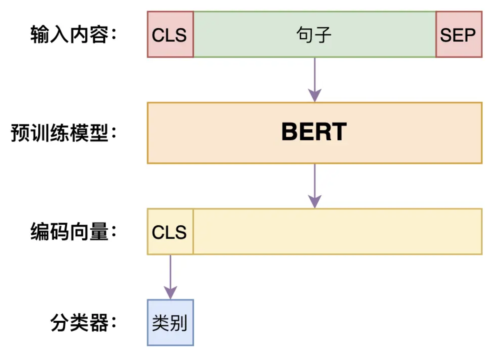

# 微调BERT进行文本分类

Bert是基于Transformer的编码器和海量文本训练出的预训练模型，他通过学习完型填空和上下句预测的任务来获得类似人类一样对通用语义的理解能力。在文本分类场景，只需要将原始文本输入到Bert中，就可以利用到预训练的token embedding知识以及Bert的self Attention结构直接将文本转化为对应的特征向量，其中向量的第一个位置[CLS]单独用来给下游分类任务使用的，比如文本分类，情感分类，一对文本的相似匹配分类等等，Bert对下游分类任务的微调网络示意图如下




在正式开始前先安装必要的依赖库。

```bash
!pip install modelscope transformers datasets torch scikit-learn 'accelerate>=0.26.0' -i https://pypi.tuna.tsinghua.edu.cn/simple
```


### 加载预训练模型

#### BERT-base-Chinese

bert-base-chinese是一款基于 BERT（Bidirectional Encoder Representations from Transformers）架构的预训练语言模型，专为中文自然语言处理任务而设计。BERT 是 Google 于 2018 年推出的具有开创性的预训练模型，借助大规模无监督训练方式，得以学习到极为丰富的语言表示。bert-base-chinese是 BERT 在中文语料上完成预训练的版本，内部包含 12 层 Transformer 编码器，拥有 110 万个参数。该模型在海量中文文本上进行了大规模预训练，因此可广泛应用于各类中文自然语言处理任务，诸如文本分类、命名实体识别、情感分析等等。
在运用bert-base-chinese模型时，既能够将其当作特征提取器，把输入文本转化为固定长度的向量表示，随后将这些向量输入至其他机器学习模型中开展训练或推断；也能够对bert-base-chinese进行微调，使其适配特定任务的训练。预训练的bert-base-chinese模型可通过 Hugging Face 的 Transformers 库来加载与使用。模型加载完毕后，可利用其encode方法将文本转换为向量表示，或者运用forward方法针对文本进行特定任务的预测。需留意的是，bert-base-chinese属于通用型中文语言模型，在某些特定任务上或许难以展现出卓越性能。在部分情形下，可能需要采用更大规模的模型，亦或是进行微调操作，以此获取更为理想的性能表现。

本文就将介绍如何微调bert-base-chinese模型来实现文本分类。
首先，我们从huggingface上下载数据集

先在当前目录创建一个文件夹用于保存模型文件：

```base
!mkdir bert_base_chinese
```


然后去modelscope上下载模型文件：https://www.modelscope.cn/models/tiansz/bert-base-chinese/files


```bash
!modelscope download --model tiansz/bert-base-chinese --local_dir bert_base_chinese
```

下载完成后，我们先直接加载一个预训练的BERT中文模型，使用它做基础的情感预测，体验一下分类效果。

```Python
from transformers import BertTokenizer, BertForSequenceClassification, pipeline

# 加载本地的预训练模型（注意此模型未进行过情感分类任务微调）
model = BertForSequenceClassification.from_pretrained(
    'bert_base_chinese', num_labels=3  # 假设我们做3分类
)
tokenizer = BertTokenizer.from_pretrained('bert_base_chinese')

# 构建分类器 pipeline：封装了tokenizer + model + 前后处理
classifier = pipeline('text-classification', model=model, tokenizer=tokenizer)

# 简单测试几句话
texts = ['我今天心情很好', '你好，我是AI助手', '我今天很生气']
for text in texts:
    output = classifier(text)
    print(f"{text} => {output}")

```

推理结果如下，可以发现bert-base-chinese在实现文本分类的时候效果并不是很好。


其中`pipeline` 是transformers库中非常便捷的封装，适用于快速推理；

因为模型未fine-tune，所以预测结果不太准，只是用来展示结构。

### 加载数据集+文本清洗

接下来我们训练自己的情感模型，先加载本地Parquet格式的数据，并进行文本预处理。

首先我们需要去huggingface上下载ChnSentiCorp数据集。

**ChnSentiCorp** 是一个专为中文情感分析任务设计的高质量数据集，广泛应用于自然语言处理（NLP）领域的研究和教学。

该数据集包含约 12,000 条来自真实网络平台的用户评论，涵盖酒店住宿、笔记本电脑使用评价和书籍阅读感受等多个领域。每条评论都经过人工标注，情感标签分为正面（1）和负面（0），确保了数据的准确性和可靠性。数据集被划分为训练集（9,600 条）、验证集（1,200 条）和测试集（1,200 条），便于模型的训练和评估。

ChnSentiCorp 的多领域覆盖和高质量标注，使其成为中文情感分析研究的重要资源，适用于学术研究、教学实践以及企业产品优化等多种应用场景。

先下载依赖库

```bash
!pip install -U huggingface_hub -i https://pypi.tuna.tsinghua.edu.cn/simple
```

由于huggingface在国内的下载速度很慢，所以我们需要借助镜像网站下载数据集：

```bash
!export HF_ENDPOINT=https://hf-mirror.com 
```

然后创建一个文件夹用于保存数据集：

```bash
!mkdir Chnsenticorp
```

将数据集下载到文件夹中：

```bash
!huggingface-cli download --repo-type dataset --resume-download lansinuote/ChnSentiCorp --local-dir Chnsenticorp
```

数据集下载完成后就可以进行下一步操作了

```Python
from datasets import load_dataset
import re

# 指定数据所在的目录（Parquet 格式的数据）
data_dir = "Chnsenticorp/data"

# 使用 Huggingface datasets 加载本地 parquet 文件（train/valid/test）
dataset = load_dataset('parquet', data_files={
    'train': f"{data_dir}/train-00000-of-00001-02f200ca5f2a7868.parquet",
    'validation': f"{data_dir}/validation-00000-of-00001-405befbaa3bcf1a2.parquet",
    'test': f"{data_dir}/test-00000-of-00001-5372924f059fe767.parquet"
})

# 定义文本清洗函数：去除非中英文字符（标点、特殊符号等）
def clean_text(text):
    text = re.sub(r'[^\w\s]+', ' ', text)  # 替换非文字字符为空格
    return text.strip()

# 应用清洗函数
dataset = dataset.map(lambda x: {'text': clean_text(x['text']), 'label': x['label']})

```


### 文本分词和编码处理

BERT 模型不能直接处理原始文本，它需要把文本分成 Token 并转换成 ID，因此我们进行如下处理：

```python
# 使用已经加载的 tokenizer 对文本进行编码
def tokenize_function(examples):
    return tokenizer(examples['text'], padding='max_length', truncation=True, max_length=128)

# 对整个数据集进行编码处理（batched=True 会加速处理）
encoded_dataset = dataset.map(tokenize_function, batched=True)

```

`padding='max_length'` 保证每个句子等长；

`max_length=128` 是最大句子长度（可根据任务调整）；

输出将包含 `input_ids`、`attention_mask`，供BERT使用。

### bert-base-chinese 微调

使用模型的分词器对数据集处理后，将处理之后的数据放入模型进行训练，我们仅训练1轮看看效果。训练完之后再测试集上进行预测查看训练效果。并将模型保存，实现代码如下。

```Python
from transformers import TrainingArguments, Trainer

# 配置训练参数
training_args = TrainingArguments(
    output_dir='./results',                  # 训练过程的输出目录
    num_train_epochs=1,                       # 训练轮数
    per_device_train_batch_size=16,           # 训练批大小
    per_device_eval_batch_size=16,            # 验证批大小
    learning_rate=2e-5,                       # 学习率大小
    eval_strategy='epoch',                    # 每个 epoch 做一次验证
    logging_steps=10,                         # 每10条打印一次损失
    logging_dir='./logs'                    # 日志文件输出路径
)

# 使用 Trainer 封装训练逻辑
trainer = Trainer(
    model=model,
    args=training_args,
    train_dataset=encoded_dataset['train'],
    eval_dataset=encoded_dataset['validation'],
)

# 开始训练
trainer.train()
# 在测试集上评估模型
trainer.evaluate(encoded_dataset['test'], metric_key_prefix='eval')

# 保存训练好的模型与分词器
model.save_pretrained('./sentiment_model')
tokenizer.save_pretrained('./sentiment_model')

```

`Trainer` 是 Transformers 提供的高级训练接口，简化了训练逻辑；

`TrainingArguments` 是训练参数配置器；

`eval_dataset` 会在每个 epoch 结束时评估模型。

`save_pretrained()` 会将模型权重和配置保存到指定目录，后续可直接加载；

这是部署模型的关键一步。

训练过程如下图所示：


训练完成


这里只进行了一轮的训练，总用时73s，Loss为0.277。

可以适当提高训练轮数，或者调整学习率大小，使得损失更小

### 加载训练好的模型并使用

```Python
from transformers import AutoModelForSequenceClassification, pipeline

# 加载保存好的模型
model = AutoModelForSequenceClassification.from_pretrained('./sentiment_model')
tokenizer = BertTokenizer.from_pretrained('./sentiment_model')

# 使用 pipeline 进行推理
classifier = pipeline('text-classification', model=model, tokenizer=tokenizer)

# 测试样例
texts = ['我今天心情很好', '你好，我是AI助手', '我今天很生气']
for text in texts:
    output = classifier(text)
    print(f"{text} => {output}")

```

推理结果如下：


我们可以发现，使用lansinuote/ChnSentiCorp数据集对模型训练之后，模型在对文本分类方面的能力得到了大幅加强。

模型微调只是针对某种下游任务，针对性的强化模型的能力，但是微调之后的模型在泛化能力上有所下降。