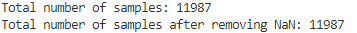
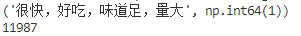
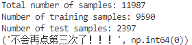
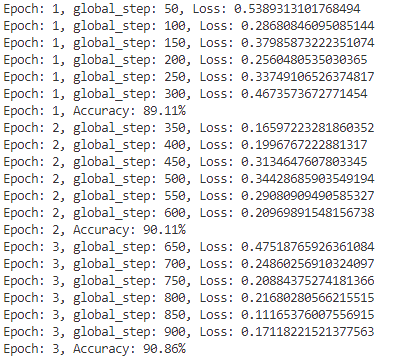
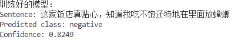

# 微调RoBERTa进行文本分类

本次我们实战的内容是微调RoBERTa并对新的数据集进行文本分类任务。

首先这里我们简单讲解一下什么是文本分类任务：

这里有一句话Sentence1：“我喜欢你。”我们可以很容易地判断出来这句话是积极的。同理，对于句子Sentence2:“我讨厌你。”我们也可以知道这句话是消极的。

像上面这样把句子归到不同类别里面的做法就是文本分类。

在本次实战中，我们将用10k条外卖数据对RoBERTa模型进行微调，并最终用自己新生成的一系列数据基于训练好的模型进行推理。

在正式开始前先安装必要的依赖库：

```bash
!pip install modelscope transformers datasets torch scikit-learn 
'accelerate>=0.26.0' -i https://pypi.tuna.tsinghua.edu.cn/simple
```

### 数据集下载

#### 📄 数据集 waimai_10k

#### 来源：

- 来自 Hugging Face 上的公开数据集：`XiangPan/waimai_10k`

- 包含约 10,000 条来自美团外卖的中文用户评论和情感标签

  样例格式：

  ```text
  review,label
  "这个外卖真的不错，配送也很快！",1
  "菜太难吃了，态度也差，不会再点了！",0
  ```

huggingface上提供了该数据集的下载方法，但国内直连hf官网速度很慢，这里推荐使用镜像网站：https://hf-mirror.com

```bash
!pip install -U huggingface_hub -i https://pypi.tuna.tsinghua.edu.cn/simple
!export HF_ENDPOINT=https://hf-mirror.com 
```

创建一个文件夹用于保存数据集：

```bash
!mkdir waimai_10k
```

然后通过以下命令来下载数据集

```bash
!huggingface-cli download --repo-type dataset --resume-download XiangPan/waimai_10k --local-dir waimai_10k
```


### 下载RoBERTa模型

#### 1. 🤖 RoBERTa（rbt3）

RoBERTa 是 Facebook 基于 BERT 改进的预训练语言模型，特点包括：

- 去除了 NSP 任务，只保留 MLM
- 更长的训练时间和更大数据量
- 更强的性能表现

你使用的是哈工大推出的 **中文 RoBERTa-wwm-ext（rbt3）** 版本，适用于中文 NLP 任务。

它是一个 `BertForSequenceClassification` 类型的模型（BERT/RoBERTa 本质一样，区别只是预训练细节），用于二分类。

modelscope提供了这个模型的下载地址

模型的下载路径为：

https://www.modelscope.cn/models/dienstag/rbt3/files

首先创建一个模型目录用来存放模型文件：

```bash
!mkdir rbt3
```

下载模型：

```bash
modelscope download --model dienstag/rbt3 --local_dir rbt3
```

### 加载数据集

##### 首先加载第三方库以及刚下载好的数据集

```Python
from transformers import AutoTokenizer, AutoModelForSequenceClassification
import torch
import torch.nn as nn
import torch.optim as optim
from torch.utils.data import DataLoader, Dataset
from torch.utils.data import random_split

##加载数据

import pandas as pd
data = pd.read_csv('waimai_10k/waimai_10k.csv')
data.head()
print(f"Total number of samples: {len(data)}")
data = data.dropna()
print(f"Total number of samples after removing NaN: {len(data)}")

```



整个数据集拥有11987条数据

##### 创建Dataset，进行实例化，方便后续的训练

继承Pytorch的Dataset类并创建自己的MyDataset类，于此同时我们还要改写两个方法，一个是__len__，另一个是__getitem__。

```python
class MyDataset(Dataset):
    def __init__(self, data):
        super().__init__()
        self.data = data.dropna()

    def __len__(self):
        return len(self.data)

    def __getitem__(self, index):
        return self.data.iloc[index]['review'], self.data.iloc[index]['label']

##将MyDataset进行实例化
dataset = MyDataset(data)
print(dataset[0])
print(len(dataset))
```



在这条数据集中，“很快，好吃，味道足，量大”，为用户的评价，“1” 则表示这条评价是积极的（0是消极的）

##### 划分数据集

这里我们按照0.8和0.2的比例对数据集进行划分，将80%的数据作为训练集，20%的数据作为测试集。

```bash
trainset, testset = random_split(dataset, [0.8, 0.2])
print(f"Total number of samples: {len(dataset)}")
print(f"Number of training samples: {len(trainset)}")
print(f"Number of test samples: {len(testset)}")
print(trainset[0])
```



##### 创建DataLoader

这里我们根据刚才创建的Dataset去创建DataLoader，其中训练集和验证集的Batch_size都设置为64。但在这里我们实现了一个collate_func函数，这个函数的作用是对我们数据集的文本信息进行操作，将其tokenize化之后变成tensor向量。

```python
tokenizer = AutoTokenizer.from_pretrained("rbt3")

def collate_func(batch):
    texts, labels = [], []
    for item in batch:
        texts.append(item[0])
        labels.append(item[1])
    inputs = tokenizer(texts, padding="max_length", truncation=True, max_length=512, return_tensors="pt")
    inputs["labels"] = torch.tensor(labels)
    return inputs

train_dataloader = DataLoader(trainset, batch_size=32, shuffle=True, collate_fn=collate_func)
test_dataloader = DataLoader(testset, batch_size=32, shuffle=False, collate_fn=collate_func)

print(next(iter(train_dataloader)))
```


##### 创建模型和优化器

这里我们创建的优化器为Adam，模型是从hugging face上下载加载预训练好的RoBERTa模型。

```python
model=AutoModelForSequenceClassification.from_pretrained("rbt3")
optimizer=optim.AdamW(model.parameters(),lr=1e-5)

if torch.cuda.is_available():
    model.cuda()
model.eval()

# 推理
sentence1 = "这家饭店真贴心，知道我吃不饱还特地在里面放蟑螂"
id2_label = {0: "negative", 1: "positive"}

with torch.inference_mode():
    inputs = tokenizer(sentence1, return_tensors="pt", padding=True, truncation=True)
    inputs = {k: v.cuda() for k, v in inputs.items()}
    logits = model(**inputs).logits
    softmax_ = torch.nn.functional.softmax(logits, dim=1)
    predicted_class = torch.argmax(logits, dim=-1)
    print("原模型：")
    print(f"Sentence: {sentence1}")
    print(f"Predicted class: {id2_label.get(predicted_class.item())}")
    print(f"Confidence: {softmax_[0][predicted_class.item()]:.4f}")
```

从结果可以看出，未经过训练微调的RoBERTa模型，预测置信度只有0.62


##### 训练和验证

验证代码：

```python
def evaluate():
    model.eval()
    correct = 0
    with torch.inference_mode():
        for batch in test_dataloader:
            if torch.cuda.is_available():
                batch = {k: v.cuda() for k, v in batch.items()}
            outputs = model(**batch)
            loss = outputs.loss
            logits = outputs.logits
            predictions = torch.argmax(logits, dim=-1)
            correct += (predictions == batch['labels']).sum().item()
    return correct / len(test_dataloader.dataset) * 100  ## 返回准确率
```

训练代码：

```python
def train(epoch=3, log_step=50):
    global_step = 0
    for ep in range(epoch):
        model.train()
        for batch in train_dataloader:
            if torch.cuda.is_available():
                batch = {k: v.cuda() for k, v in batch.items()}
            optimizer.zero_grad()
            outputs = model(**batch)
            loss = outputs.loss
            loss.backward()
            optimizer.step()
            if (global_step+1) % log_step == 0:
                print(f"Epoch: {ep+1}, global_step: {global_step+1}, Loss: {loss.item()}")
            global_step += 1

        acc = evaluate()
        print(f"Epoch: {ep+1}, Accuracy: {acc:.2f}%")
    # 保存模型权重
    save_path = "rbt3_finetuned"
    model.save_pretrained(save_path)
    print(f"Model weights saved to {save_path}")

train() #开始训练
```

在这里，设置的训练轮数是3轮，log梯度为50，学习率为1e-5，大家可以适当调整训练参数，从而优化训练效率降低Loss。

训练过程如下：



##### 模型推理

```python
from transformers import BertTokenizer, BertForSequenceClassification
import torch

save_path = "rbt3_finetuned"

# 加载你训练好的模型
save_path = "rbt3_finetuned"
model = BertForSequenceClassification.from_pretrained(save_path)
model.cuda()
model.eval()

# 推理
sentence1 = "这家饭店真贴心，知道我吃不饱还特地在里面放蟑螂"
id2_label = {0: "negative", 1: "positive"}

with torch.inference_mode():
    inputs = tokenizer(sentence1, return_tensors="pt", padding=True, truncation=True)
    inputs = {k: v.cuda() for k, v in inputs.items()}
    logits = model(**inputs).logits
    softmax_ = torch.nn.functional.softmax(logits, dim=1)
    predicted_class = torch.argmax(logits, dim=-1)

    print("训练好的模型：")
    print(f"Sentence: {sentence1}")
    print(f"Predicted class: {id2_label.get(predicted_class.item())}")
    print(f"Confidence: {softmax_[0][predicted_class.item()]:.4f}")
```

训练结果如下：



从结果可以看出，模型推理的置信度为0.82，相较于训练前的0.62，训练后的模型置信度有了较大的提升。

