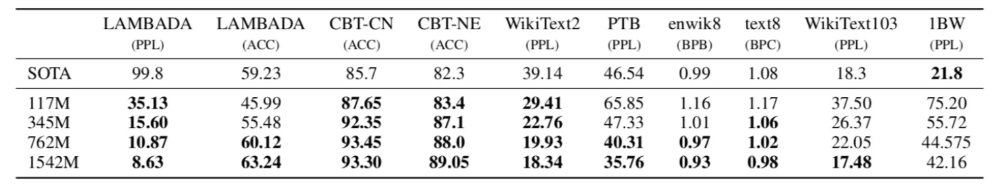
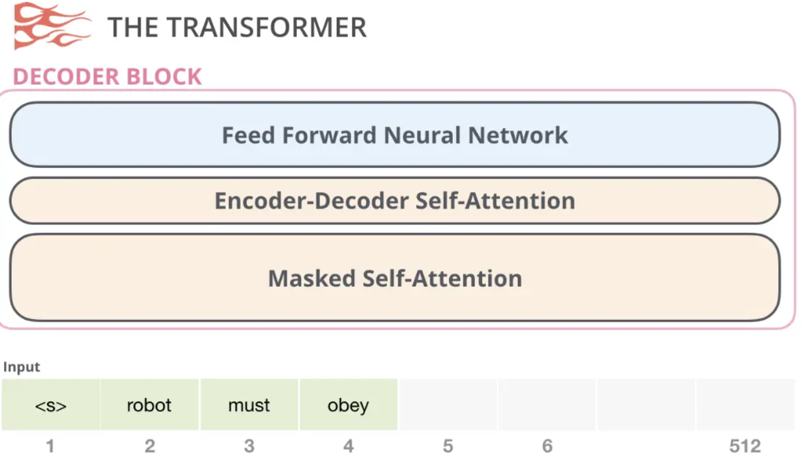
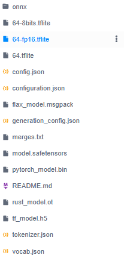
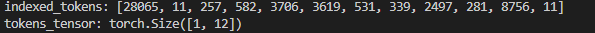
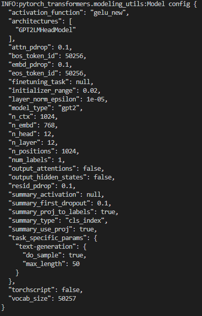

# 预训练GPT2模型生成文本

OpenAI 在论文 [Improving Language Understanding by Generative Pre-Training]中提出了 GPT 模型。GPT 模型是由单向 Transformer 的解码器构建的模型，OpenAI 团队在一个非常大的书籍数据集 [the Toronto Book Corpus] 上对其进行了无监督预训练。
而后，OpenAI 团队又提出了 [GPT-2 模型]，GPT-2 模型是 GPT 模型的后继，使用了更大的训练集训练，有更多的参数，是 GPT 模型的扩大版。GPT-2 的训练集为数量有 8 百万的网页，由研究人员从网络上爬取得到，大小共有 40 GB 的文本数据，训练任务为给出上文，使模型预测下一个单词。
由于 GPT 与 GPT-2 模型的差别就在于 GPT-2 使用了更多的训练数据，增加了模型参数，在具体结构上并无较大差异。所以，下面我们主要介绍实际表现更优异的 GPT-2 模型。

### GPT2 核心思想

根据研究发现，语言有灵活的表达能力，即能够将任务、输入、输出表示成一个字符串，并且模型可以用这种形式的字符串进行训练，学习相应任务。

例如，在翻译任务中，一个训练样本可以被写成
(translate to french, english text, french text)
同样地，在阅读理解任务中，一个训练样本可以被写成
(answer the question, document, question, answer)

并且，人们可以用以上格式的多种任务的训练样本同时训练一个模型，使得该模型获得同时执行多种任务的能力。
于是 OpenAI 研究人员推测，一个具有足够能力的语言模型将学习到推理和执行训练样本中所展示出的任务，以便更好地预测它们。如果一个语言模型能够做到这一点，那么它实际上就是在进行无监督的多任务学习。

于是研究人员决定通过分析语言模型在各种各样的任务上的性能来测试这种情况是否属实，这样便有了 GPT-2 的产生。
而且正如他们所推测的，GPT-2 在多种任务上的性能表现很好，具体如下图：


所以 GPT-2 对于其他预训练模型的一个突破就在于，它能够在未针对特定下游任务进行训练的条件下，就在下游任务如：阅读理解、机器翻译、问答和文本概括上有很好的表现。

这也表明了，在模型足够大，训练数据足够充足时，无监督训练技术也能训练出在多种下游任务上有很好表现的模型。
因为监督学习需要大量的数据，并且需要被仔细清理过的数据，想要得到这样的数据需要昂贵的人力成本。

无监督学习可以克服这个缺点，因为它不需要人工标注，有大量现成的数据可以利用。这也表明了 GPT-2 模型研究的意义。
在了解了构建 GPT-2 模型的思想后，接下来我们将详细了解一下 GPT-2 模型的结构。

### **单向 Transformer 解码器结构**

GPT-2 模型由多层单向 Transformer 的解码器部分构成，本质上是自回归模型，自回归的意思是指，每次产生新单词后，将新单词加到原输入句后面，作为新的输入句。其中 Transformer 解码器结构如下图：



### GPT2文本生成

GPT-2 就是一个语言模型，能够根据上文预测下一个单词，所以它就可以利用预训练已经学到的知识来生成文本，如生成新闻。也可以使用另一些数据进行微调，生成有特定格式或者主题的文本，如诗歌、戏剧。所以接下来，我们会用 GPT-2 模型进行一个文本生成实验。

#### 下载GPT2模型

由于国内网络限制，这里选择在modelscope上下载模型

首先下载modelscope库

```python
!pip install modelscope -i https://pypi.tuna.tsinghua.edu.cn/simple
```

然后创建一个文件夹用于存放模型

```bash
!mkdir gpt2
```

下载模型

```bash
!modelscope download --model AI-ModelScope/gpt2 --local_dir gpt2
```

完整模型文件如下：



#### **预训练模型生成新闻**

想要直接运行一个预训练好的 GPT-2 模型，最简单的方法是让它自由工作，即随机生成文本。换句话说，在开始时，我们给它一点提示，即一个预定好的起始单词，然后让它自行地随机生成后续的文本。
但这样有时可能会出现问题，例如模型陷入一个循环，不断生成同一个单词。为了避免这种情况， GPT-2 设置了一个 top-k 参数，这样模型就会从概率前 k 大的单词中随机选取一个单词，作为下一个单词。下面是选择 top-k 的函数的实现，

```Python
import random

def select_top_k(predictions, k=10):
    predicted_index = random.choice(
        predictions[0, -1, :].sort(descending=True)[1][:10]).item()
    return predicted_index

```

下面引入 GPT-2 模型，我们将使用在 PyTorch-Transformers 模型库中封装好的 GPT2Tokenizer() 和 GPT2LMHeadModel() 类来实际看一下 GPT-2 在预训练后的对下一个词预测的能力。首先，需要安装 PyTorch-Transformers。

```bash
!pip install pytorch-transformers==1.0 -i https://pypi.tuna.tsinghua.edu.cn/simple
```

使用 PyTorch-Transformers 模型库，先设置好准备输入模型的例子，使用 GPT2Tokenizer() 建立分词器对象对原句编码。

```python
import random
import torch
from pytorch_transformers import GPT2Tokenizer, GPT2LMHeadModel
import logging

logging.basicConfig(level=logging.INFO)

device = torch.device("cuda" if torch.cuda.is_available() else "cpu")

def select_top_k(predictions, k=10):
    predicted_index = random.choice(
        predictions[0, -1, :].sort(descending=True)[1][:k]).item()
    return predicted_index

# 加载 tokenizer
tokenizer = GPT2Tokenizer.from_pretrained('/text7/gpt2')#替换为你的实际路径

# 文本编码
text = "Yesterday, a man named Jack said he saw an alien,"
indexed_tokens = tokenizer.encode(text)
tokens_tensor = torch.tensor([indexed_tokens]).to(device)
print("indexed_tokens:",indexed_tokens)
print("tokens_tensor:",tokens_tensor.shape)

```

文本编码的结果如下：




接下来使用 GPT2LMHeadModel() 建立模型，并将模型模式设为验证模式。

```Python
# 加载模型
model = GPT2LMHeadModel.from_pretrained("/text7/gpt2")#替换为你的实际路径
model.to(device)
model.eval()

```

GPT2相关配置



准备好模型后就可以利用gpt2进行文本生成了。

```Python
total_predicted_text = text
n = 100

for _ in range(n):
    with torch.no_grad():
        outputs = model(tokens_tensor)
        predictions = outputs[0]

    predicted_index = select_top_k(predictions, k=10)
    total_predicted_text += tokenizer.decode(predicted_index)

    if '<|endoftext|>' in total_predicted_text:
        break

    indexed_tokens += [predicted_index]
    tokens_tensor = torch.tensor([indexed_tokens]).to(device)

print(total_predicted_text)
```

利用gpt2续写的文本如下：

```Txt
Yesterday, a man named Jack said he saw an alien, possibly a man or animal in a car. The driver then sped off on their motorbike before being pulled up next door in order. The man and driver got into another accident at 7 a and when it went out into a field at 6 am the car pulled back out of sight."<|endoftext|>
```

