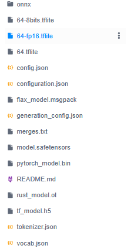
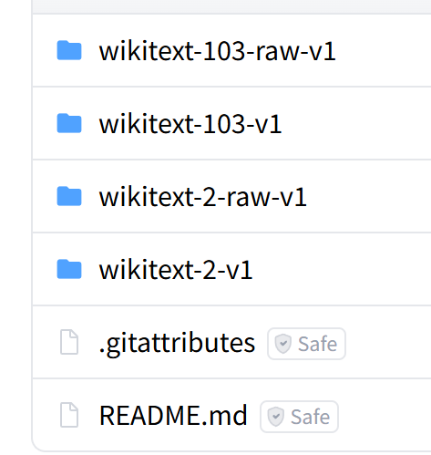
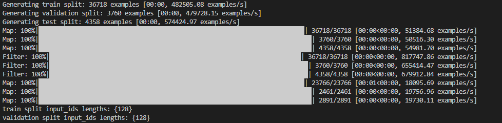
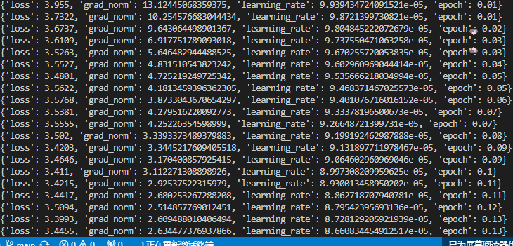
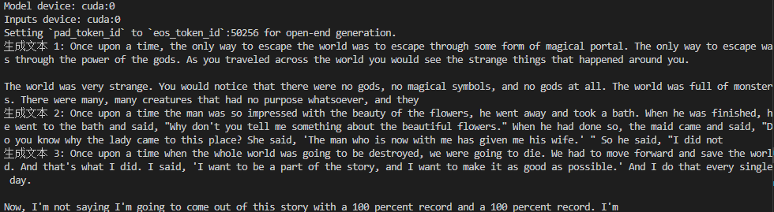

# 训练GPT2模型生成文本

文本生成是自然语言处理（NLP）领域的重要任务之一，旨在根据给定的提示或上下文生成连贯、有意义的文本。GPT-2（Generative Pretrained Transformer 2）是 OpenAI 提出的一种基于 Transformer 架构的预训练语言模型，具有强大的文本生成能力。本文将详细介绍如何使用 Python 和 Hugging Face 的 transformers 库对 GPT-2 模型进行微调，以实现高质量的文本生成。

### 1、GPT-2 微调的作用

#### 1.1 微调前的 GPT-2 模型
GPT-2 是一个预训练的语言模型，它在大规模的文本数据上进行了无监督训练，学习到了丰富的语言知识和生成能力。然而，预训练的 GPT-2 模型虽然能够生成连贯的文本，但可能无法很好地适应特定的任务或领域的数据。例如，如果我们在一个特定领域的数据集上进行评估，预训练的 GPT-2 模型可能无法生成与该领域相关的高质量文本。

#### 1.2 微调的作用

微调（Fine-tuning）是指在预训练模型的基础上，使用特定任务的数据集进行进一步训练，以使模型更好地适应该任务或领域。通过微调，我们可以使 GPT-2 模型学习到特定领域的知识和语言模式，从而提高其在该领域的文本生成能力。微调后的 GPT-2 模型能够生成更符合特定领域需求的文本，具有更高的准确性和相关性。

#### 1.3 微调步骤

1. **加载预训练模型**
    微调通常从一个在大规模数据上预训练的模型开始，如 GPT-2。预训练模型已经学习了通用的语言模式和知识。

2. **数据预处理**
    将特定领域的数据集加载并处理为模型可以接受的格式。例如，使用 Hugging Face 的 datasets 库加载和预处理数据。

3. **配置训练参数**
    设置训练参数，如学习率、批量大小、训练轮数等。这些参数决定了模型如何适应新数据。

4. **模型训练**
    在特定领域的数据上训练预训练模型，使模型学习到领域特定的模式和知识。在训练过程中，模型的参数会根据新数据进行调整。

5. **模型评估**
    在验证集上评估微调后模型的性能，以确保模型在特定任务上取得了良好的效果。

6. **模型保存与部署**
    保存微调后的模型，以便在实际应用中使用。可以将其部署为 Web 服务或集成到其他应用程序中。

### 2、微调实操

#### 2.1 环境准备

在开始之前，确保已安装以下必要的 Python 库：

transformers：用于加载和使用 Hugging Face 提供的预训练模型。
torch：深度学习框架，支持模型的训练和推理。
datasets：用于加载和处理数据集。
accelerate：用于简化模型训练过程中的硬件加速配置。
安装命令如下：

```bash
!pip install transformers torch datasets accelerate -i https://pypi.tuna.tsinghua.edu.cn/simple

```

#### 2.2 下载模型

由于国内网络限制，这里选择在modelscope上下载模型

首先下载modelscope库

```python
!pip install modelscope -i https://pypi.tuna.tsinghua.edu.cn/simple
```

然后创建一个文件夹用于存放模型

```bash
!mkdir gpt2
```

下载模型

```bash
!modelscope download --model AI-ModelScope/gpt2 --local_dir gpt2
```

完整模型文件如下：



#### 2.3 加载模型

加载刚从 modelscope上下载的预训练 GPT-2 模型和分词器：

```
from transformers import AutoModelForCausalLM, AutoTokenizer, Trainer, TrainingArguments, DataCollatorForLanguageModeling
from datasets import load_dataset
import re

# 加载模型和分词器
model_name = "/model/gpt2"  # 替换为你的模型路径
model = AutoModelForCausalLM.from_pretrained(model_name)
tokenizer = AutoTokenizer.from_pretrained(model_name)
tokenizer.pad_token = tokenizer.eos_token
model.config.pad_token_id = model.config.eos_token_id

```

#### 2.4 下载数据集

本案例使用的数据集为wikitext数据集

WikiText 是一个用于自然语言处理（NLP）任务的英文语言建模数据集，由 Salesforce Research 于 2016 年发布。它从维基百科中经过人工审核的“优质”和“特色”条目中提取，保留了原始的大小写、标点和数字信息，适合训练能够捕捉长距离依赖的语言模型。

WikiText 数据集包含两个主要版本：

- **WikiText-2**：包含约 200 万个词元（tokens），适用于中小规模模型的训练和评估。
- **WikiText-103**：包含超过 1 亿个词元，适合大规模语言模型的训练，广泛用于评估模型在长文本建模中的表现。

由于modelscope没有完整的wikitext数据集，故这里使用Huggingface的镜像网站下载数据集：

首先下载必要安装包：

```bash
!pip install -U huggingface_hub -i https://pypi.tuna.tsinghua.edu.cn/simple
```

设置环境：

```bash
!export HF_ENDPOINT=https://hf-mirror.com 
```

新建一个文件夹用于存储数据集

```
!mkdir wikitext
```

下载数据集

```bash
!huggingface-cli download --repo-type dataset --resume-download Salesforce/wikitext --local-dir wikitext
```

下载完成后数据集目录如下所示：



由于时间关系，在这里我们仅使用wikitext-2-raw-v1数据集

#### 2.5、数据集处理

对数据集进行预处理，包括文本编码，添加特殊token等

```Python
# 加载数据集
data_dir = "/home/jiangsiyuan/bdqn/dataset/wikitext"
dataset = load_dataset('parquet', data_files={
    'train': f"{data_dir}/train-00000-of-00001.parquet",
    'validation': f"{data_dir}/validation-00000-of-00001.parquet",
    'test': f"{data_dir}/test-00000-of-00001.parquet"
})

# 清洗文本
def clean_text(text):
    text = re.sub(r'[^\w\s\u4e00-\u9fff]+', ' ', text)
    return text.strip()

dataset = dataset.map(lambda x: {'text': clean_text(x['text'])})
dataset = dataset.filter(lambda x: len(x['text'].strip()) > 0)

# 预处理数据
def tokenize_function(examples):
    return tokenizer(examples['text'], padding='max_length', truncation=True, max_length=128)

encoded_dataset = dataset.map(tokenize_function, batched=True, remove_columns=['text'])
encoded_dataset.set_format('torch', columns=['input_ids', 'attention_mask'])

# 检查序列长度
for split in ['train', 'validation']:
    lengths = [len(sample['input_ids']) for sample in encoded_dataset[split]]
    print(f"{split} split input_ids lengths: {set(lengths)}")
```



#### 2.6 准备训练

```Python
# 配置训练参数
training_args = TrainingArguments(
    output_dir="./gpt2_finetuned",
    overwrite_output_dir=True,
    num_train_epochs=1,
    learning_rate=1e-4,
    per_device_train_batch_size=2,
    per_device_eval_batch_size=2,
    eval_strategy="epoch",
    logging_dir="./logs",
    logging_steps=20
)

# 数据整理器
data_collator = DataCollatorForLanguageModeling(tokenizer=tokenizer, mlm=False)
```

开始训练：

```Python
# 定义 Trainer
trainer = Trainer(
    model=model,
    args=training_args,
    train_dataset=encoded_dataset["train"],
    eval_dataset=encoded_dataset["validation"],
    data_collator=data_collator
)

# 训练
trainer.train()
# 保存模型和分词器
trainer.save_model("./gpt2_finetuned")
tokenizer.save_pretrained("./gpt2_finetuned")
```

训练过程如下：



#### 2.7 生成文本

```Python
# 生成文本
prompt = "Once upon a time"
inputs = tokenizer(prompt, return_tensors="pt")
# 将 inputs 移动到模型所在的设备
inputs = {k: v.to(model.device) for k, v in inputs.items()}
# 打印设备信息以调试
print(f"Model device: {model.device}")
print(f"Inputs device: {inputs['input_ids'].device}")

outputs = model.generate(
    **inputs,
    max_length=100,
    num_return_sequences=3,
    do_sample=True,
    top_k=50,
    top_p=0.95,
    temperature=0.7
)

# 输出结果
for i, output in enumerate(outputs):
    print(f"生成文本 {i+1}: {tokenizer.decode(output, skip_special_tokens=True)}")
```

