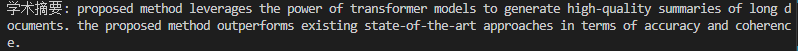

# 文本摘要提取

在这个信息爆炸的时代，每天都有海量的信息产生，而如何从这些庞大的信息中快速获取关键内容成为了一个亟待解决的问题。文本摘要技术应运而生，它能够帮助我们高效地提取文档中的核心信息，节省大量时间。Python作为一门功能强大的编程语言，在自然语言处理领域有着广泛的应用。本文将详细介绍Python中的一种主流的文本摘要方法-T5模型，并结合实际案例进行分析。


### 1. 文本摘要的基本概念
文本摘要是将长篇幅的文本压缩成较短的版本，同时保留原文的主要信息和意义。根据生成方式的不同，文本摘要可以分为两类：抽取式摘要（Extractive Summarization）和生成式摘要（Abstractive Summarization）。

**抽取式摘要：**通过识别并提取文档中的关键句子或短语来生成摘要。这种方法简单直观，但可能无法完全反映文档的整体意思。
**生成式摘要：**利用自然语言生成技术，重新组合文档中的词汇和句子，生成新的摘要。这种方法更灵活，但实现难度较大。


### 2.T5模型

#### 2.1 模型简介

Text-to-Text预训练模型，也称为T5模型，在NLP领域中具有广泛的应用前景。本文将重点介绍T5模型的基本原理、特点以及应用场景。

T5模型是一种基于Transformer架构的NLP模型，它的核心思想是将文本数据中的句子按照固定长度进行切分，然后将切分后的子序列作为输入，通过Transformer[网络](https://cloud.baidu.com/product/et.html)进行编码和解码。在训练过程中，T5模型使用大规模的文本数据集进行预训练，从而学习到文本数据的内在规律和特征表示。

T5模型在NLU和NLG上都具有出色表现，能够完成翻译任务、文本分类、阅读理解、摘要生成任务等多种下游任务。


#### 2.2 模型架构

如下图所示，T5模型本质上是基于一个Encoder-Decoder架构搭建的目前基于Transformer的模型架构主要有Encoder-Decoder结构

Encoder-Decoder结构：Seq2Seq常用模型，编码器输入中可以看到序列中包括自己的全部字符，解码器的输出只能看到当前字符及之前的字符；


### 3 实操

#### 3.1 准备工作

先安装好必要的环境依赖：

```bash
!pip install transformers sentencepiece rouge -i https://pypi.tuna.tsinghua.edu.cn/simple
```

接下来去modelscope上下载T5模型。

由于原T5模型的参数量较大，在这里仅供演示，下载T5-small模型即可


下载地址：[t5-small · 模型库](https://www.modelscope.cn/models/AI-ModelScope/t5-small/files)

下载modelscope依赖库：

```bash
!pip install modelscope -i https://pypi.tuna.tsinghua.edu.cn/simple
```

创建一个文件夹用来存放模型：

```bash
!mkdir T5-small
```

下载模型

```bash
!modelscope download --model AI-ModelScope/t5-small --local_dir T5-small
```

等待模型下载完成：


至此，准备工作完成！

#### 3.2 使用T5-small提取摘要

T5（Text-to-Text Transfer Transformer）是另一个强大的预训练模型，适用于多种自然语言处理任务。T5模型将所有任务视为文本到文本的任务，这使得它非常灵活。

首先将下载好的模型导入，**记得将模型路径替换为你实际的模型路径**

```python
from transformers import T5Tokenizer, T5ForConditionalGeneration

tokenizer = T5Tokenizer.from_pretrained('T5-small') #替换路径
model = T5ForConditionalGeneration.from_pretrained('T5-small') #替换路径
```

**文本摘要**：

```python
#文本摘要
def generate_summary_t5(text):
    inputs = tokenizer.encode("summarize: " + text, return_tensors="pt", max_length=512, truncation=True)
    summary_ids = model.generate(inputs, max_length=150, min_length=40, length_penalty=2.0, num_beams=4, early_stopping=True)
    summary = tokenizer.decode(summary_ids[0], skip_special_tokens=True)
    return summary

text = """
Natural language processing (NLP) is a field of computer science, artificial intelligence, and linguistics concerned with the interactions between computers and human (natural) languages. As such, NLP is related to the area of human–computer interaction. Many challenges in NLP involve natural language understanding, that is, enabling computers to derive meaning from human or natural language input, and others involve natural language generation.
"""

print("文本摘要:",generate_summary_t5(text))
```

结果如下：


**新闻摘要：**

新闻摘要是一个常见的应用场景，特别是在新闻网站和新闻应用中。使用生成式摘要技术可以自动生成新闻的摘要，帮助用户快速了解新闻的核心内容。

```python
#新闻摘要
def generate_news_summary(text):
    inputs = tokenizer([text], max_length=1024, return_tensors='pt', truncation=True)
    summary_ids = model.generate(inputs['input_ids'], num_beams=4, max_length=150, early_stopping=True)
    summary = tokenizer.decode(summary_ids[0], skip_special_tokens=True)
    return summary

news_article = """
In a significant development, scientists have discovered a new species of dinosaur in South America. The discovery was made in the Patagonia region of Argentina, where paleontologists unearthed the remains of a previously unknown herbivorous dinosaur. This new species, named Argentinosaurus, is believed to have lived during the Late Cretaceous period, approximately 95 million years ago. The findings, published in the journal Nature, provide valuable insights into the evolution and diversity of dinosaurs in the region.
"""

print("新闻摘要:",generate_news_summary(news_article))
```

输出结果：

**学术论文摘要**

学术论文摘要可以帮助读者快速了解论文的主要研究内容和结论。使用生成式摘要技术可以自动生成论文的摘要，提高阅读效率。

```python
def generate_paper_summary(text):
    inputs = tokenizer.encode("summarize: " + text, return_tensors="pt", max_length=512, truncation=True)
    summary_ids = model.generate(inputs, max_length=150, min_length=40, length_penalty=2.0, num_beams=4, early_stopping=True)
    summary = tokenizer.decode(summary_ids[0], skip_special_tokens=True)
    return summary

paper_text = """
This paper presents a novel approach to text summarization using deep learning techniques. The proposed method leverages the power of transformer models to generate high-quality summaries of long documents. Experiments conducted on a diverse range of datasets demonstrate that the proposed method outperforms existing state-of-the-art approaches in terms of both accuracy and coherence. The findings of this study have significant implications for the field of natural language processing and highlight the potential of deep learning in text summarization tasks.
"""

print(generate_paper_summary(paper_text))

```

输出结果：



**ROUGE**

ROUGE是一组评估文本摘要质量的指标，主要包括ROUGE-N、ROUGE-L等。ROUGE-N衡量的是n-gram的重叠度，而ROUGE-L则衡量的是最长公共子序列的长度。

```python
from rouge import Rouge

def evaluate_summary(reference, hypothesis):
    rouge = Rouge()
    scores = rouge.get_scores(hypothesis, reference)
    return scores

reference_summary = "Scientists discover new dinosaur species in Patagonia."
hypothesis_summary = "New dinosaur species found in South America."

print("ROUGE:",evaluate_summary(reference_summary, hypothesis_summary))
```

输出结果

