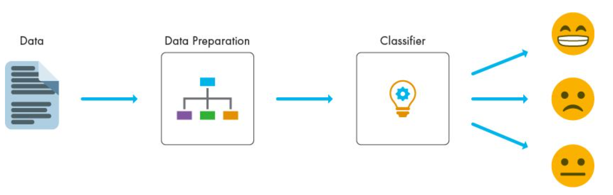
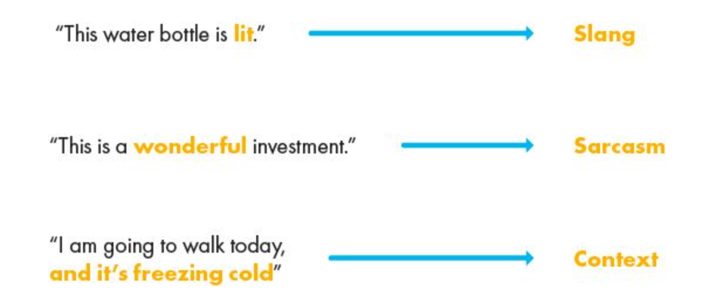
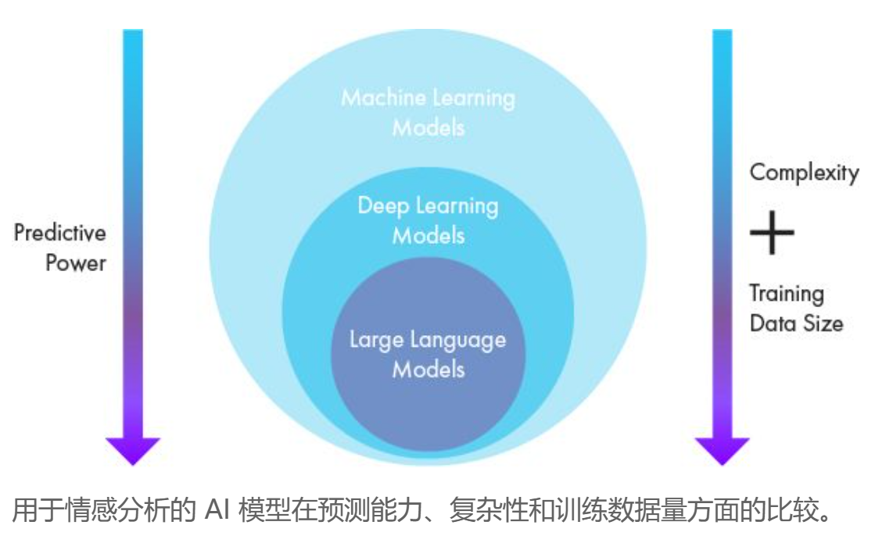
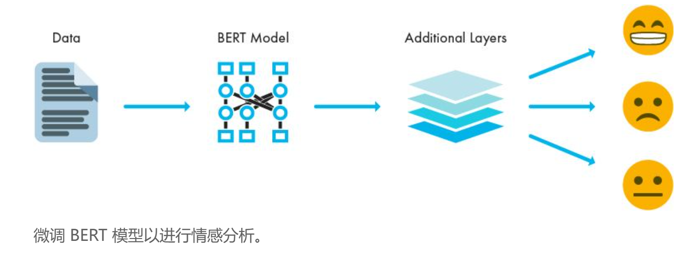
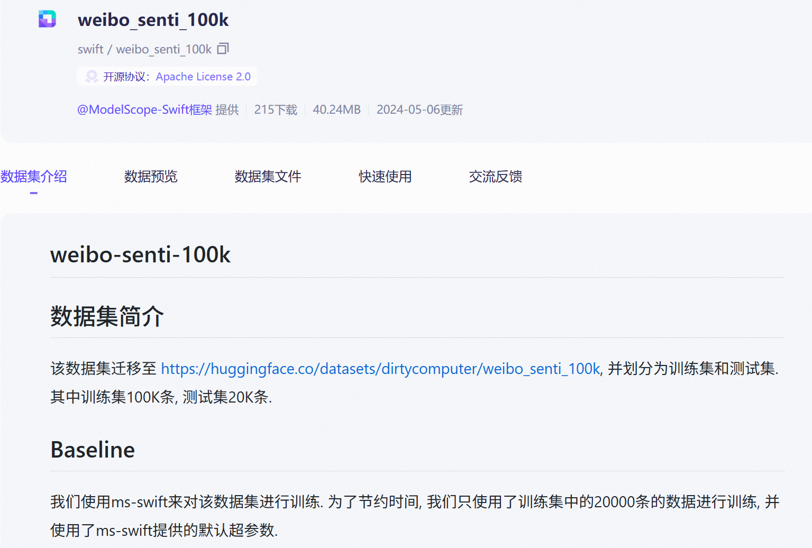
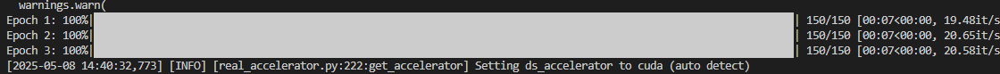
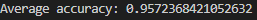
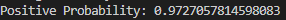

# 微调BERT进行情感分析

### 情感分析

#### 含义

情感分析涉及应用高级计算方法从文本数据中识别和提取主观信息。情感分析利用机器学习算法、基于规则的方法或结合利用两者将文本分类为积极、消极或中性等情绪类别。

通过分析语言特征、上下文语义和语法结构，情感分析能够深入地了解大量数据集中的观点。因此，情感分析在理解语义细微差别和在数据丰富的环境中自动解释人类情绪方面非常有效。

情感分析首先从数据源（如社交媒体、评论或调查）收集文本输入。情感分析的两个关键步骤是准备数据以确保它适合对数据中的情绪进行分析和分类。选择合适的分类器取决于数据和所需的灵活性。



#### 面临的挑战

几项挑战使得文本数据中情绪的准确解释和分类变得复杂。一个重要的挑战是自然语言固有的歧义性和多样性。文本数据可能包含讽刺、反讽或俚语表达，算法很难正确解释。例如“这是一笔很棒的投资”这个短语，如果含有讥讽的意思，就有完全不同的解读。

情感分析中的另一项挑战是对领域特定的文本数据进行分类。基于通用数据集训练的情感分析分类器可能在专业领域（如工程或科学）中表现不佳。例如，机械工程师或神经学家会使用非常专业的术语。通常，预训练的情感分析分类器不太可能基于此类术语进行训练。

克服这些挑战需要使用高级 AI 模型进行情感分析，这些模型能够进行上下文理解。但即便如此，这些模型仍可能需要微调才能有效地处理领域特定的数据。 



#### 用于情感分析的 AI 模型的类型

情感分析可利用各种 AI 模型，这些模型可以大致分为传统的[机器学习模型](https://ww2.mathworks.cn/discovery/machine-learning-models.html)和[深度学习](https://ww2.mathworks.cn/discovery/deep-learning.html)模型。

传统的机器学习模型，如决策树和[支持向量机 (SVM)](https://ww2.mathworks.cn/discovery/support-vector-machine.html)，依赖特征提取方法（如[词袋](https://ww2.mathworks.cn/discovery/bag-of-words.html)）将文本转换为数字表示。这些模型基于带标签的数据集进行训练，以学习与不同情绪类相关联的模式。尽管其计算效率很高并且[可解释](https://ww2.mathworks.cn/discovery/interpretability.html)，但其性能取决于特征工程的质量，并且它们可能难以捕获复杂的语言细微差别和上下文。

深度学习模型提供一种更复杂的理解语言的方法。[循环神经网络 (RNN)](https://ww2.mathworks.cn/discovery/rnn.html) 及其变体（如[长短期记忆 (LSTM)](https://ww2.mathworks.cn/discovery/lstm.html) 网络）可以处理顺序数据，使其适合学习文本数据中的长期相关性。[卷积神经网络 (CNN)](https://ww2.mathworks.cn/discovery/convolutional-neural-network.html) 也可以与词嵌入（如 [word2vec](https://ww2.mathworks.cn/discovery/word2vec.html)）结合以用于情感分析。

一种特殊类型的深度学习模型是变换器模型。在 NLP 中引入变换器模型，如 [BERT（变换器的双向编码器表示）](https://ww2.mathworks.cn/help/textanalytics/ref/bert.html)，极大地提高了情感分析能力。




#### 使用LLM进行情感分析

大型语言模型 (LLM)，例如 GPT 模型，有一个底层变换器架构。变换器模型可以捕获人类语言中单词之间的复杂关系和细微差别。这些模型的计算量很大，需要大型训练数据集，但能够为情感分析提供最大的准确度和灵活性。 

LLM 可以针对情感分析任务进行微调。微调涉及针对特定任务调节预训练模型。这种方法支持使用较小的数据集来重新训练大型模型，同时仍实现高准确性。例如，您可以向 BERT 模型添加额外的层，并使用较小的数据集重新训练以执行情感分析。



### 微调BERT-base-chinese模型进行情感分析

#### 下载数据集

我们使用公开的微博[数据集](https://so.csdn.net/so/search?q=数据集&spm=1001.2101.3001.7020)(weibo_senti_100k)进行训练，此数据集已经进行标注，0: 负面情绪，1:正面情绪。数据集共计82718条(包含标题)。如下图



安装modelscope库：

```bash
pip install modelscope -i https://pypi.tuna.tsinghua.edu.cn/simple
```

创建一个文件夹用来存放数据文件

```bash
!mkdir weibo_100k
```

下载数据集：

```bash
modelscope download --dataset swift/weibo_senti_100k --local_dir weibo_100k
```

#### 下载bert-base-chinese 模型

该模型可以用于实现文本分类、实体识别等任务。

它是一个基于Transformer架构的中文预训练模型，使用了大量的中文语料进行训练。它在多个中文自然语言处理任务上表现出色，如文本分类、命名实体识别和情感分析等。

通过使用bert-base-chinese，我们可以将其用作下游任务的特征提取器或者进行微调以适应特定任务。

创建一个文件夹用来存放模型文件

```bash
!mkdir bert-base-chinese
```

```bash
modelscope download --model tiansz/bert-base-chinese --local_dir bert-base-chinese
```

#### 环境库安装

```bash
pip install transformers==4.49.0 torch -i https://pypi.tuna.tsinghua.edu.cn/simple
```

至此，我们的准备工作已经全部完成！

#### 微调

首先导入必要的库

```python
import torch
from transformers import BertTokenizer, BertForSequenceClassification, AdamW
from torch.utils.data import DataLoader, Dataset, random_split
import pandas as pd
from tqdm import tqdm
import random
```

加载之前下载好的模型与数据集：

```python
# 读取训练数据集
df = pd.read_csv("weibo_100k/weibo_senti_100k.csv")  # 替换为你训练数据集路径
# 加载预训练的BERT模型和分词器
tokenizer = BertTokenizer.from_pretrained('bert-base-chinese')#替换为你下载的模型路径
model = BertForSequenceClassification.from_pretrained('bert-base-chinese')

```

对数据集进行处理

注意：此处需要打乱数据行，为了快速训练展示，下面程序只加载了1500条数据。

```python
# 设置随机种子以确保可重复性
random.seed(42)
# 随机打乱数据行
df = df.sample(frac=1).reset_index(drop=True)
# 数据集中1为正面，0为反面
class SentimentDataset(Dataset):
    def __init__(self, dataframe, tokenizer, max_length=128):
        self.dataframe = dataframe
        self.tokenizer = tokenizer
        self.max_length = max_length

    def __len__(self):
        return len(self.dataframe)

    def __getitem__(self, idx):
        text = self.dataframe.iloc[idx]['review']
        label = self.dataframe.iloc[idx]['label']
        encoding = self.tokenizer(text, padding='max_length', truncation=True, max_length=self.max_length, return_tensors='pt')
        return {
            'input_ids': encoding['input_ids'].flatten(),
            'attention_mask': encoding['attention_mask'].flatten(),
            'labels': torch.tensor(label, dtype=torch.long)
        }

# 创建数据集对象
dataset = SentimentDataset(df[:1500], tokenizer)

```

将数据集进行划分

```python
# 划分训练集和验证集
train_size = int(0.8 * len(dataset))
val_size = len(dataset) - train_size
train_dataset, val_dataset = random_split(dataset, [train_size, val_size])

# 创建数据加载器
train_loader = DataLoader(train_dataset, batch_size=8, shuffle=True)
val_loader = DataLoader(val_dataset, batch_size=8, shuffle=False)
```

定义训练优化器，开始训练

```python
optimizer=AdamW(model.parameters(),lr=5e-5)
device=torch.device("cuda" if torch.cuda.is_available() else "cpu")
model.to(device)

# 训练模型
model.train()
for epoch in range(3):  # 3个epoch作为示例
    for batch in tqdm(train_loader, desc="Epoch {}".format(epoch + 1)):
        input_ids = batch['input_ids'].to(device)
        attention_mask = batch['attention_mask'].to(device)
        labels = batch['labels'].to(device)
        
        optimizer.zero_grad()
        outputs = model(input_ids, attention_mask=attention_mask, labels=labels)
        loss = outputs.loss
        loss.backward()
        optimizer.step()
```

训练过程如下：



训练完成后保存模型参数

```python
# 保存模型
model.save_pretrained('/home/jiangsiyuan/personal/bdqn/test10/model')
tokenizer.save_pretrained('/home/jiangsiyuan/personal/bdqn/test10/model')
print("Model saved successfully.")
```

在训练集上测试：

```python
# 加载微调后的模型
model=BertForSequenceClassification.from_pretrained('/home/jiangsiyuan/personal/bdqn/test10/model')
tokenizer=BertTokenizer.from_pretrained('/home/jiangsiyuan/personal/bdqn/test10/model')
model.to(device)


# 评估模型
model.eval()
total_eval_accuracy=0

for batch in tqdm(val_loader,desc="Evaluating"):
    input_ids=batch['input_ids'].to(device)
    attention_mask=batch['attention_mask'].to(device)
    labels=batch['labels'].to(device)

    with torch.no_grad():
        outputs=model(input_ids,attention_mask=attention_mask,labels=labels)

    logits=outputs.logits
    preds=torch.argmax(logits,dim=1)
    accuracy=(preds==labels).float().mean()
    total_eval_accuracy+=accuracy.item()

average_eval_accuracy=total_eval_accuracy/len(val_loader)

print(f"Average accuracy: {average_eval_accuracy}")
```

结果如下，从结果可以看出预测的正确率高达95%



使用微调后的模型进行预测

```python
def predict_sentiment(sentence):
    inputs = tokenizer(sentence, padding='max_length', truncation=True, max_length=128, return_tensors='pt').to(device)
    with torch.no_grad():
        outputs = model(**inputs)
    logits = outputs.logits
    probs = torch.softmax(logits, dim=1)
    positive_prob = probs[0][1].item()  # 1表示正面
    print("Positive Probability:", positive_prob)

# 测试一个句子
predict_sentiment("好好学习天天向上")
```

预测结果如下：



从输出结果可知，该句子表达的是正向的情感